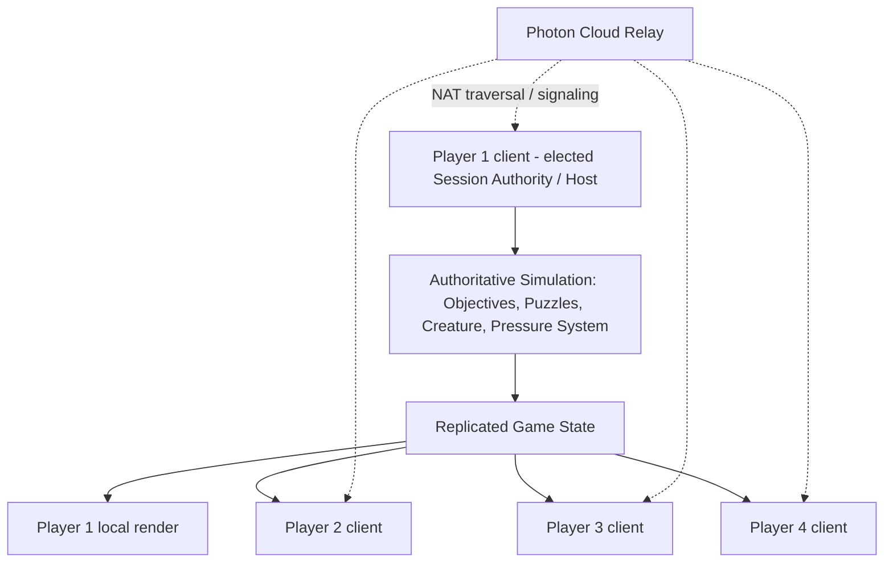
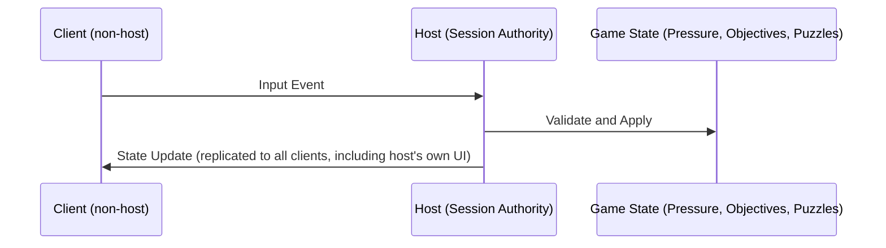

# Network Architecture

## Purpose

This document defines the multiplayer networking architecture for Project Echo. It specifies how the game handles state synchronization, replication, authority, and session recovery in Photon Fusion 2.

## Scope

This document covers:

- Session topology
- Authority and ownership rules
- Replication strategy
- Match state synchronization
- Failure handling and recovery

## Dependencies

- Photon Fusion 2 is the authoritative networking middleware ([ADR-0001](ADR/0001-photon-fusion-2-as-networking-middleware.md)).
- The game must support 2–4 players online.
- The architecture must support real-time interaction, voice communication, and state replication.
- **Topology is fixed as Fusion Host Mode (client-hosted, with native host migration) — [ADR-0002](ADR/0002-network-topology-host-mode.md).** This is a resolved decision, not an open question; the rest of this document assumes it throughout.

## Diagrams

### Network Topology — Fusion Host Mode

No dedicated server process exists. The host is an ordinary connected player's client; Photon's cloud relay handles connectivity/NAT traversal only, not simulation. If the host disconnects, Fusion's native Host Migration elects a new authority from the remaining clients (see §Host Migration below) — this is a built-in Fusion capability, not custom-built reconnection logic.

### Replication Flow

## Examples

### Example 1: Interaction Replication

A player interacts with a relay panel. The request is validated by the authoritative state and then broadcast to all clients.

### Example 2: Creature State Sync

The host-controlled creature simulation updates the shared threat state and the clients receive the new state as replicated data.

## Edge Cases

- Network jitter causes delayed interaction confirmation.
- A player sends input twice because of packet loss.
- The host disconnects while a critical objective is resolving.
- A client reconnects during a creature escalation event.

## Design Decisions

### Decision 1: Use Host-Authoritative Resolution for Gameplay State

Per ADR-0002, the elected host client — not a dedicated server — owns the match's critical gameplay state, including objectives, hazards, creature behavior, and the Pressure System (11 Stress System.md). This preserves consistency and fairness at zero hosting cost, at the accepted trade-off recorded in ADR-0002 (a malicious host has full authority; acceptable for private 2–4 player sessions, not for a future public-matchmaking mode without revisiting the ADR).

### Decision 2: Use Local Prediction Only for Player Movement and Feedback

Local prediction is acceptable for movement and immediate feedback, but it should not be used to determine objective completion, puzzle resolution, or creature/pressure state — those remain host-computed and replicated, never predicted.

### Decision 3: Prioritize Deterministic State Transitions

The network architecture should avoid ambiguous or race-prone logic. If multiple players trigger the same state transition, the host should resolve the order deterministically (input received-order at the host, not client timestamp, to avoid clock-skew exploits).

### Decision 4: Host Migration Must Preserve, Not Reset, State

Per 11 Stress System.md's §Ownership requirement, a migrated host must be initialized from the last acknowledged authoritative snapshot (Pressure, objective, and puzzle state) before assuming authority — never from a fresh/default state. Fusion's native migration handles peer re-election; this document's implementation is responsible for the state hand-off payload.

## Host Migration

1. Fusion detects host disconnect and elects a replacement from remaining connected clients (Fusion-native behavior, no custom election logic required).
2. Before the new host's simulation goes live, it must receive the last state each authoritative system had acknowledged: the current `PressureState`/`PlayerStressState` (11 Stress System.md), active `PuzzleDefinition` states (07 Puzzle Framework), and objective lifecycle state (09 Objective System). These three systems already replicate a compact snapshot every tick specifically so a recently-received snapshot is always available for this hand-off.
3. If no snapshot has been received by any remaining client within the last 2.0 seconds before migration (e.g., host crashed mid-tick), the most recent snapshot any client holds is used — some sub-second staleness is accepted rather than resetting to default state, per Decision 4.
4. Migration should complete within a target of 3.0 seconds; if it does not, the session is treated as unrecoverable and the match ends gracefully (see Multiplayer.md's reconnect tolerance).

## Authority Ownership

Consolidated index — each row's actual field-level detail is owned and defined by the cited document, not repeated here. This section exists so "who owns what" can be answered from one place without redefining any of it (respecting the single-authoritative-owner rule established in this remediation pass).

| System | Authority | Detail owned by |
|---|---|---|
| Global Pressure, Per-Player Stress, Pressure Bands | Elected Host | [11 Stress System.md](../docs/GDD/11%20Stress%20System.md) |
| Puzzle state (`PuzzleDefinition`, lifecycle) | Elected Host | [07 Puzzle Framework.md](../docs/GDD/07%20Puzzle%20Framework.md) |
| Objective state (lifecycle, dependency graph) | Elected Host | [09 Objective System.md](../docs/GDD/09%20Objective%20System.md) |
| Creature FSM state and position | Elected Host | [10 Monster AI.md](../docs/GDD/10%20Monster%20AI.md) |
| Player movement (predicted) | Owning client, host-reconciled | [04 Player Systems.md](../docs/GDD/04%20Player%20Systems.md) |
| Player progression, unlocks, currency | Each client independently, written to PlayFab | §Save Synchronization below |
| Voice (Vivox) | Vivox's own relay, out of band from Fusion | [05 Communication System.md](../docs/GDD/05%20Communication%20System.md) |

## Replicated State Inventory

What actually goes over the wire each tick, for capacity planning. Field-level schemas remain owned by each system's own document; this is a size/frequency index only.

| Payload | Frequency | Approx. size | Defined in |
|---|---|---|---|
| `PressureSnapshot` (+ per-player `PlayerStressEntry[]`) | 10 Hz | ~29–61 bytes | 11 Stress System.md |
| Puzzle state deltas | On state change (event-driven, not per-tick) | Variable, small | 07 Puzzle Framework.md |
| Objective state deltas | On state change (event-driven) | Variable, small | 09 Objective System.md |
| Player transform | Fusion's standard networked-transform cadence (client-predicted, host-reconciled — no custom rate defined here; inherits Fusion's default simulation tick) | Small, per player | 04 Player Systems.md |
| Creature transform + state | 10 Hz, matching Pressure tick since Hunting/Tracking gating reads the same tick boundary | Small | 10 Monster AI.md |

Total steady-state payload for a 4-player match is dominated by the Pressure snapshot and player/creature transforms, all well within Fusion's default per-session bandwidth budget for a 2–4 player title — no custom bandwidth optimization is required for MVP, consistent with "optimize for shipping, not scale."

## Late Join

A player joining mid-session (via Steam invite or matchmaking lobby, per 20 Steam Integration.md / 21 Backend.md) receives, from the Host, in this order:

1. Current `PressureSnapshot`, including a freshly-initialized `PlayerStressEntry` for themselves at `S = 0.25 * P` with no isolation bonus (per 11 Stress System.md's existing Late Join rule — not redefined here, only sequenced).
2. Current Puzzle state snapshot for all active/blocked puzzles (per 07 Puzzle Framework's existing "Late Joiners" rule).
3. Current Objective state and dependency graph (per 09 Objective System).
4. Creature current state and position (per 10 Monster AI).
5. Full facility/room state relevant to their own Asymmetric Reality assignment (per 06 Asymmetric Reality — the late-joining player's personal reality layer is generated at this point, not before).

This ordering matters: Pressure/Puzzle/Objective/Creature state is team-wide and identical for any joiner, so it is sent first and uniformly; the player's personal Asymmetric Reality assignment is generated last because it depends on which player slot they occupy. Target budget: full late-join state transfer completes within 2.0 seconds of connection, so a joining player is not left in a blank or partial state during an active Pressure escalation.

## Disconnect Recovery (Non-Host)

Distinct from Host Migration (§Host Migration above), which only applies when the Host specifically disconnects. This section covers any other player disconnecting.

1. On disconnect, the Host marks that player's `PlayerStressState` and owned interactions (if mid-interaction) as released — any puzzle interaction they were performing is cancelled cleanly, per 07 Puzzle Framework's existing disconnect-handling rule (not redefined here).
2. The disconnected player's slot is held open for a **60-second grace window**, during which the match continues for the remaining players (Global Pressure and objectives are unaffected by one player's absence, per 11 Stress System.md's team-shared model — their personal Isolation-driven Stress simply stops updating for them since they're not receiving ticks).
3. If they reconnect within the grace window, they rejoin via the same procedure as §Late Join above, using their existing `PlayerStress` entry rather than a fresh one (since `S = 0.25*P` would otherwise discard their pre-disconnect isolation state; on reconnect their entry is instead re-synced from the Host's current record of it, un-paused).
4. If the grace window expires without reconnection, the player is formally removed from the session; if that removal drops the party below the minimum viable count for continuing (a value owned by 19 Multiplayer.md, not this document), the match ends per that document's rules.

## Save Synchronization

This section defines the boundary between this document's live, in-session, Host-authoritative state and 22 Save System.md / technical/Database.md's persistent, cross-session state — they are deliberately different systems with different authorities, and this boundary was previously undocumented (an actual gap this remediation pass closes, not a restatement).

- **In-session state** (Pressure, Puzzle, Objective, Creature) is Host-authoritative for the duration of the match and is never persisted — this repeats 11 Stress System.md's existing "not persisted" rule only insofar as it applies identically to Puzzle and Objective state, which had not previously stated this explicitly.
- **Persistent progression** (XP, unlocks, currency, cosmetics — owned by 15 Progression.md, 22 Save System.md, technical/Database.md) is **not relayed through the Host**. Each client independently reports its own player's match-end results directly to PlayFab when the match concludes. This is a deliberate architectural choice: if progression writes depended on the Host relaying them, a Host crash immediately before match-end could cost every other player their earned progression, not just the Host's own. Independent per-client writes mean a Host crash after a match's outcome is determined only risks the Host's own unsaved progression, not the whole team's.
- This does mean match-end results (e.g., "the team escaped") must be determined identically and deterministically by every client from the same final `PressureSnapshot`/Objective state they already received as the authoritative Host's last broadcast — no client re-derives the outcome differently, they simply each independently persist their own record of an outcome they all observed identically.

## Anti-Cheat Assumptions

Per ADR-0002, the Host is fully trusted for the duration of a match — that risk is accepted, not engineered around, for private 2–4 player sessions. That acceptance does **not** extend to persistent, cross-session data, where a compromised or modified Host client could otherwise let a player write arbitrary progression/currency values directly to PlayFab. Concretely:

- Live match-state authority (Pressure, Puzzle, Objective, Creature): fully trusted Host, no server-side validation for MVP. Accepted risk per ADR-0002.
- Persistent progression writes (§Save Synchronization): PlayFab writes for XP, currency, and unlocks must go through **PlayFab CloudScript server-side validation with sanity bounds** (e.g., a hard per-match XP ceiling derived from 15 Progression.md's eventual reward table) rather than accepting arbitrary client-submitted values — this is the one place a client (Host or not) is not trusted, because unlike live match state, a manipulated persistent-progression write has permanent, cross-session, potentially economy-affecting consequences.
- This is a minimum-viable boundary, not a complete anti-cheat strategy — full server-side validation of progression content depends on 15 Progression.md and 23 Economy.md's still-unspecified reward numbers (flagged as a dependency for whichever remediation pass finalizes those documents).

## Future Improvements

- Add better session recovery and reconnect handling beyond the baseline in §Host Migration and §Disconnect Recovery.
- Improve diagnostic tooling for network desync investigation.
- Revisit Server Mode if public matchmaking at scale is ever added post-launch (see ADR-0002 §Future Improvements) — not planned for MVP.

## Risks

- A poor authority model will create visible desync and unfair outcomes.
- Over-predicting state can create player confusion and debugging complexity.
- Network-edge cases can become major gameplay bugs if not planned for beforehand.

## Open Questions

- ~~Should the host be the default authoritative runtime for the MVP or should a dedicated authoritative server be used when available?~~ Resolved by ADR-0002: host-authoritative (Fusion Host Mode) for MVP and launch; dedicated servers explicitly deferred, not planned.
- How much input buffering is appropriate for the game's interaction model? Owner: Gameplay Engineering, to be measured during the Prototype phase against actual Photon relay latency in playtests, not decided speculatively here.
- What reconnect tolerance should be supported before a session is considered unrecoverable? Interim value set at 3.0 seconds for host migration (§Host Migration); non-host reconnect tolerance owner: Multiplayer design, see 19 Multiplayer.md.
