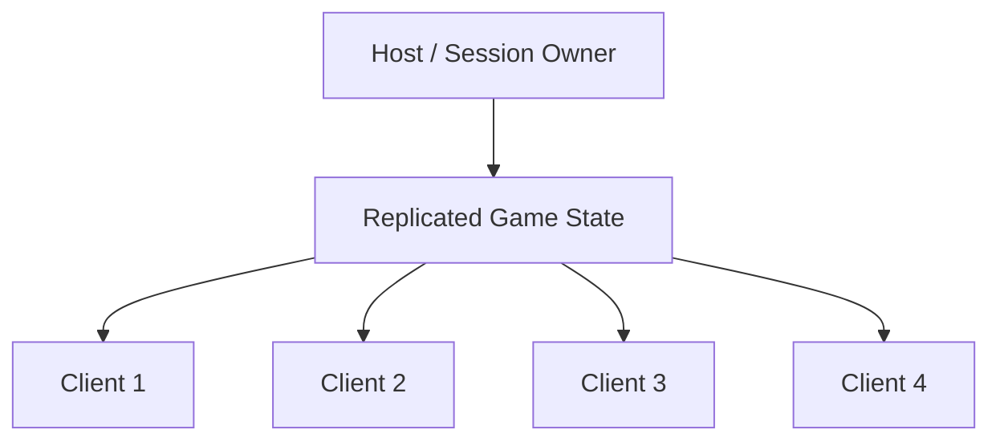
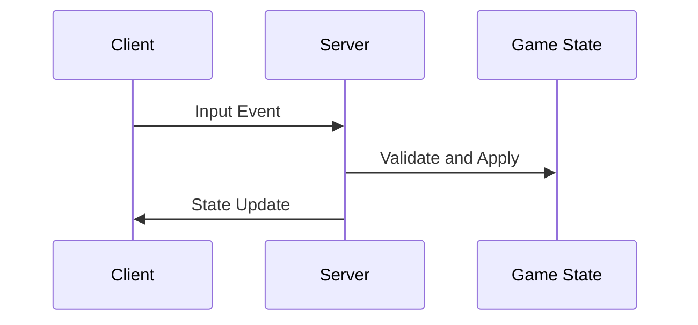

# Network Architecture

## Purpose

This document defines the multiplayer networking architecture for Project Echo. It specifies how the game handles state synchronization, replication, authority, and session recovery in Photon Fusion 2.

## Scope

This document covers:

- Session topology
- Authority and ownership rules
- Replication strategy
- Match state synchronization
- Failure handling and recovery

## Dependencies

- Photon Fusion 2 is the authoritative networking middleware.
- The game must support 2–4 players online.
- The architecture must support real-time interaction, voice communication, and state replication.

## Diagrams

### Network Topology

### Replication Flow

## Examples

### Example 1: Interaction Replication

A player interacts with a relay panel. The request is validated by the authoritative state and then broadcast to all clients.

### Example 2: Creature State Sync

The host-controlled creature simulation updates the shared threat state and the clients receive the new state as replicated data.

## Edge Cases

- Network jitter causes delayed interaction confirmation.
- A player sends input twice because of packet loss.
- The host disconnects while a critical objective is resolving.
- A client reconnects during a creature escalation event.

## Design Decisions

### Decision 1: Use Server-Authoritative Resolution for Gameplay State

The server should own the match’s critical gameplay state, including objectives, hazards, and creature behavior. This preserves consistency and fairness.

### Decision 2: Use Local Prediction Only for Player Movement and Feedback

Local prediction is acceptable for movement and immediate feedback, but it should not be used to determine objective completion or creature state.

### Decision 3: Prioritize Deterministic State Transitions

The network architecture should avoid ambiguous or race-prone logic. If multiple players trigger the same state transition, the server should resolve the order deterministically.

## Future Improvements

- Add better session recovery and reconnect handling.
- Improve diagnostic tooling for network desync investigation.
- Add region-aware match selection where practical.

## Risks

- A poor authority model will create visible desync and unfair outcomes.
- Over-predicting state can create player confusion and debugging complexity.
- Network-edge cases can become major gameplay bugs if not planned for beforehand.

## Open Questions

- Should the host be the default authoritative runtime for the MVP or should a dedicated authoritative server be used when available?
- How much input buffering is appropriate for the game’s interaction model?
- What reconnect tolerance should be supported before a session is considered unrecoverable?
