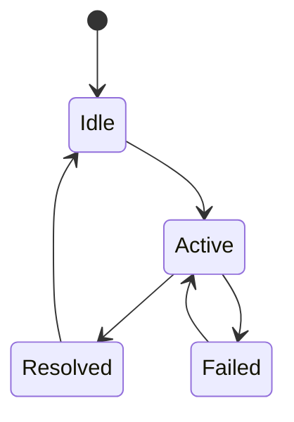
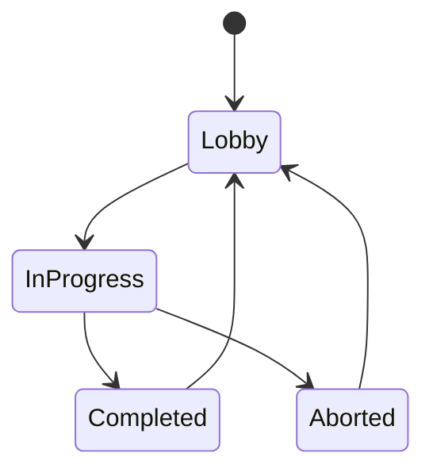

# State Machines

## Purpose

This document defines the shared state machine patterns used by Project Echo systems. It standardizes how gameplay and technical states are modeled so that design, engineering, and tooling all speak the same language.

## Scope

This document covers:

- Common state machine conventions
- Gameplay state examples
- Technical lifecycle states
- Transition and event model expectations

## Dependencies

- State machines must support player logic, objectives, puzzles, creature behavior, and match lifecycle.
- They must be implementable in Unity 6 using C#.
- The model should remain readable and testable under multiplayer conditions.

## Diagrams

### Generic State Machine Pattern

### Match Lifecycle Example

## Examples

### Example 1: Objective State Machine

An objective can move through Inactive, Active, Blocked, Resolved, and Failed states.

### Example 2: Creature State Machine

The creature can transition through Inactive, Probing, Tracking, Hunting, Retreating, and Stalled states.

## Edge Cases

- A state transition is triggered twice and causes duplicate side effects.
- A state machine is interrupted mid-transition and enters an invalid state.
- The client and server disagree about the current state after a reconnect.
- A state does not have a defined exit path and becomes stuck.

## Design Decisions

### Decision 1: Use Explicit State Models

States should be represented clearly rather than inferred from flags or booleans scattered through the code.

### Decision 2: Keep State Transitions Deterministic

Transition logic should be explicit, serializable, and easy to reason about under debugging conditions.

### Decision 3: Keep State Machines Small and Focused

Large systems should be composed of multiple smaller state machines rather than one enormous one.

## Future Improvements

- Add a visual editor or state-machine inspector for designers.
- Introduce reusable base classes for common gameplay states.
- Expand state machine documentation with examples for each major system.

## Risks

- Poorly structured state machines create hidden coupling and fragile logic.
- Overly complex state charts can become difficult to debug and maintain.
- Concurrent states can lead to inconsistent runtime behavior.

## Open Questions

- Should the team use a custom state-machine framework or simple enum-based state handlers for the MVP?
- What state machine tooling should be available to designers in the editor?
- How much state should be serialized versus computed at runtime?
