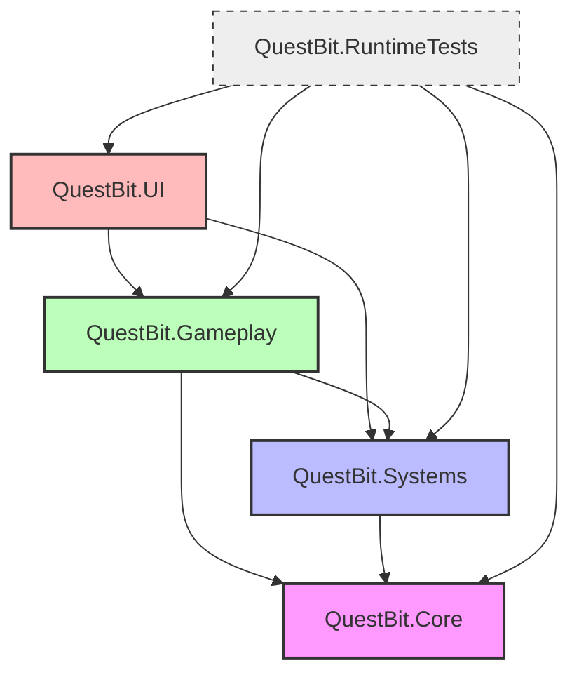

# Architectural Specification: Folder Structure & Repository Layout

* **Status**: APPROVED
* **Date**: 2026-07-09
* **Engine Focus**: Unity 6 LTS

---

## 1. Design Intent & Requirements Traceability

The repository structure establishes the architectural boundaries of QuestBit, supporting modular scaling, rapid parallel development, and clear separation of concerns:

* **Pillar-Based Subject Modularity (GDD §1.4 & Vision §6)**: Biomes and their corresponding subject domains (Tidewell Cove/Math, Inkwood/Literacy, Clockwork Marsh/Logic) must be isolated modules so they can be compiled, tested, and shipped independently as dynamic content.
* **Asset Streaming and Footprint Limits (Vision §6 & GDD §16.5)**: Code and assets must be segregated so that biome assets can be bundled into Unity Addressables. This maintains a lean initial build size (<500MB total download, <50MB per biome).
* **Decoupled System Layout (Vision §12)**: The educational logic (Mastery Engine), UI systems, save systems, and networking layers must be clearly separated to prevent coupling and ease testing.
* **Modularity and Build Pacing (GDD Appendix D)**: Assembly Definitions (`.asmdef`) will enforce strict dependency rules to prevent cyclical dependencies and accelerate compile times.

---

## 2. Directory Layout Specification

The QuestBit repository is structured with a root-level separation of Unity project files, build assets, documentation, and external developer tools.

```text
questbit-repo/
├── .github/                       # GitHub actions configurations for CI/CD
│   └── workflows/
│       ├── build_client.yml       # Automated builds (WebGL, iOS, Android)
│       └── lint_check.yml         # Auto static analysis and formatting check
├── docs/                          # Project documentation
│   └── architecture/              # System architecture documents
│       ├── 00_MASTER_INDEX.md
│       └── 01_engine_decision.md
├── tools/                         # Automated build and verification scripts
│   ├── asset_checker.py           # Validates texture formats & asset sizes
│   └── clean_project.sh           # Resets Unity cache files
└── questbit-unity/                # Main Unity Project Root
    ├── Assets/
    │   ├── ThirdParty/            # Imported Asset Store plugins (e.g., DOTween, Odin)
    │   └── _Project/              # Core project workspace (isolated from external imports)
    │       ├── AddressableAssets/ # Assets compiled into dynamic streaming bundles
    │       │   ├── Biomes/
    │       │   │   ├── TidewellCove/ # Math biome visual assets
    │       │   │   │   ├── Models/
    │       │   │   │   ├── Textures/
    │       │   │   │   └── Prefabs/
    │       │   │   ├── Inkwood/      # Literacy biome visual assets
    │       │   │   │   ├── Models/
    │       │   │   │   ├── Textures/
    │       │   │   │   └── Prefabs/
    │       │   │   └── ClockworkMarsh/ # Logic biome visual assets (Year 2)
    │       │   └── Global/        # Shared addressables (audio VO, universal UI sprites)
    │       ├── Art/               # Base non-addressable assets (compiled in player binary)
    │       │   ├── Shaders/       # Stylized 2.5D URP Shader Graphs
    │       │   └── Materials/     # Shared materials
    │       ├── Audio/             # Pre-loaded common SFX and ambient loops
    │       ├── Scenes/            # Base scene assets (minimal footprints)
    │       │   ├── Boot.unity     # Entry point scene, initializes DI & State Machine
    │       │   ├── Loading.unity  # Additive scene manager for streaming
    │       │   └── Bramble.unity  # Persistent hub-world overworld
    │       ├── Settings/          # Project configurations
    │       │   ├── URP/           # Universal Render Pipeline Settings assets
    │       │   ├── Input/         # Input Action maps (native switch-scan)
    │       │   └── Localization/  # String translation tables & font configuration assets
    │       └── Scripts/           # Complete codebase divided by assembly boundaries
    │           ├── Core/          # Foundation systems
    │           │   ├── DependencyInjection/
    │           │   ├── EventBus/
    │           │   ├── StateMachine/
    │           │   └── QuestBit.Core.asmdef
    │           ├── Gameplay/      # Mechanics, verbs, and subject systems
    │           │   ├── Verbs/     # Move, Interact, Observe, Stow, Build
    │           │   ├── Subjects/  # Tideglass, Whisper Compass, Gearwright Loom
    │           │   │   ├── Math/
    │           │   │   ├── Literacy/
    │           │   │   └── Logic/
    │           │   └── QuestBit.Gameplay.asmdef
    │           ├── Systems/       # Feature domains
    │           │   ├── AI/
    │           │   ├── Audio/
    │           │   ├── Dialogue/
    │           │   ├── DataPipeline/
    │           │   ├── Inventory/
    │           │   ├── Localization/
    │           │   ├── Networking/
    │           │   ├── Quest/
    │           │   └── Save/
    │           │   └── QuestBit.Systems.asmdef
    │           ├── UI/            # Core presentation and accessibility interfaces
    │           │   ├── Accessibility/ # Switch-scan controllers, Dyslexia overrides
    │           │   ├── Screens/   # Parent dashboard, Clue Journal, Main HUD
    │           │   └── QuestBit.UI.asmdef
    │           └── RuntimeTests/  # PlayMode tests for execution checks
    │               ├── GameplayTests/
    │               ├── SystemTests/
    │               └── QuestBit.RuntimeTests.asmdef
    ├── Packages/                  # Package manifests
    │   └── manifest.json          # Dependency list
    └── ProjectSettings/           # Unity global settings configurations
        ├── ProjectSettings.asset
        └── TagManager.asset
```

---

## 3. Modularity & Assembly Boundaries

To enforce clean architecture boundaries and speed up compilation, QuestBit uses four principal custom Assembly Definitions (`.asmdef`). These assemblies control compilation dependencies, making it impossible for low-level systems to reference high-level systems.

### Dependency Graph



### Assembly Definitions Specification

1. **`QuestBit.Core`**:
   * *Responsibility*: Low-level utility layer. Houses the Dependency Injection framework, Event Bus implementation, State Machine foundation interfaces, and common mathematical/string helpers.
   * *Dependencies*: None.
2. **`QuestBit.Systems`**:
   * *Responsibility*: Feature backend models and external integrations. Handles local storage (Save), network data serialization (Networking/DataPipeline), narrative processing (Dialogue/Quest), and physical inventories.
   * *Dependencies*: `QuestBit.Core`.
3. **`QuestBit.Gameplay`**:
   * *Responsibility*: Runtime execution. Contains physics interaction scripts, player navigation controllers (Verbs), and subject-specific game tools (Tideglass, Whisper Compass).
   * *Dependencies*: `QuestBit.Core`, `QuestBit.Systems`.
4. **`QuestBit.UI`**:
   * *Responsibility*: Visual Presentation. Implements screen layout controllers, visual effects triggers, and primary accessibility overlay controls (Dyslexia font rendering, switch-scan focus outlines).
   * *Dependencies*: `QuestBit.Gameplay`, `QuestBit.Systems`, `QuestBit.Core`.
5. **`QuestBit.RuntimeTests`**:
   * *Responsibility*: Automated QA verification. Formulates integration tests executing scene loads, save files, and fake inputs. Only compiles in development environments.
   * *Dependencies*: References all four core assemblies.

---

## 4. Constraints & Architectural Alignment

* **Asset vs. Code Separation**: High-resolution textures, models, and audio clips must never be stored inside the `Assets/_Project/Scripts/` or `Assets/_Project/Scenes/` directories. Placing assets inside script folders risks bundling them into the main compiled player build, which violates the **Web footprint budget (total build size < 500MB)**. All biome assets must live inside `Assets/_Project/AddressableAssets/Biomes/`.
* **Zero ThirdParty Pollution**: Scripts from third-party plugins (e.g., DOTween, Odin) must reside inside `Assets/ThirdParty/` to isolate code cleanup and prevent compiler namespace pollution.
* **Local-First Separation**: Networking code must be separated inside its own directory within `QuestBit.Systems` and operate asynchronously via interface abstraction. This prevents local gameplay systems from failing if the network connection drops (Offline-First constraint).

---

## 5. Failure Modes & Edge Cases

### 1. Cyclical Dependencies
* **Symptom**: Compilation fails with `Circular dependency detected between assemblies`.
* **Prevention**: Developers must never add `QuestBit.Gameplay` as a dependency inside `QuestBit.Systems`. If a system needs to communicate a state change to the gameplay layer, it must dispatch an event through the **Event Bus** (which resides in `QuestBit.Core` and is accessible by all layers).

### 2. Addressable Load Failures
* **Symptom**: A biome fails to stream in, resulting in a black screen.
* **Prevention**: Addressable paths are mapped via typed string constants or scripting assets in `QuestBit.Core` rather than magic strings. The scene structure uses fallback loading blocks (detailed in `09_scene_structure.md`) to return the player safely to the Bramble hub if a biome bundle download fails.

---

## 6. Testing & Structure Verification

1. **Folder Conformity Test (CI/CD)**: An automated Python script runs as a Git pre-commit hook or CI pipeline step to ensure:
   * No textures or audio files larger than 1MB are placed outside of the `AddressableAssets` folder.
   * No C# script files exist inside `Assets/ThirdParty/` without a corresponding `.asmdef` file to limit compiler drag.
2. **Dependency Validation**: A static analysis test validates that C# files within `QuestBit.Core` do not import namespaces from `QuestBit.Gameplay`, `QuestBit.Systems`, or `QuestBit.UI`.
