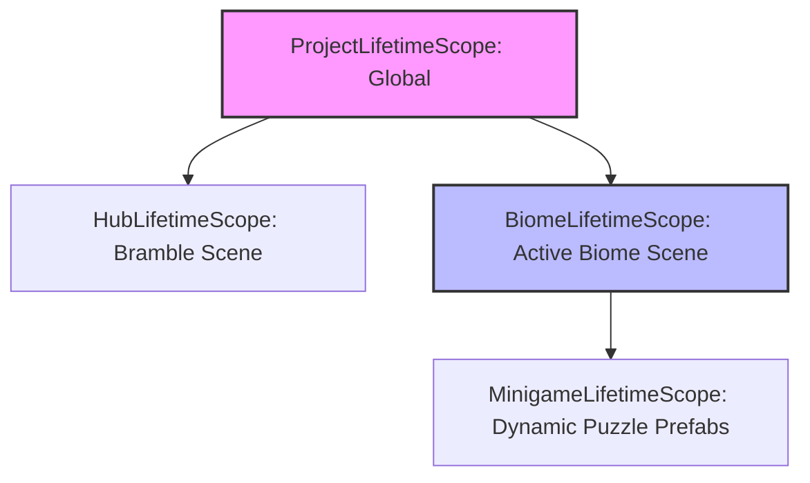
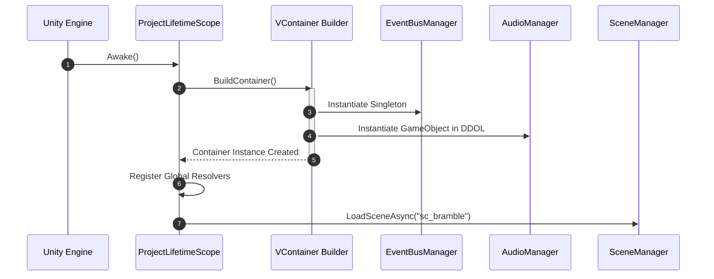

# Architectural Specification: Dependency Injection (DI)

* **Status**: APPROVED
* **Date**: 2026-07-09
* **Engine Focus**: Unity 6 LTS
* **Framework Selection**: **VContainer** (high-performance, zero-allocation DI container for Unity)

---

## 1. Design Intent & Requirements Traceability

The Dependency Injection framework controls the construction, lifetime, and access boundaries of all QuestBit components:

* **Modularity and Decoupling (GDD §1.3 & §1.4)**: Low-level gameplay tools (like the Tideglass) and UI systems must remain decoupled from backend networks or local databases. Interface injection ensures systems can be swapped out or tested in isolation.
* **Low-End Hardware Boot Budgets (Vision §2 & GDD §1.2)**: Chromebooks and mobile tablets struggle with reflection-heavy operations during initialization. VContainer is selected because it uses compile-time source generators to resolve dependencies, avoiding reflection overhead entirely and achieving a **startup resolution budget of <5ms**.
* **Offline-First Resilience (Vision §5 & GDD §1.2)**: System modules must dynamically inject stub or local-first providers (e.g., `LocalSaveSystem` vs `CloudSyncSaveSystem`) based on runtime connection checks, preventing blocking network calls.

---

## 2. Lifetime Scope Hierarchy

QuestBit organizes component lifetimes into a parent-child scope tree to prevent memory leaks and ensure assets are garbage-collected when transitioning out of a biome.



### 2.1 Scope Descriptions

1. **`ProjectLifetimeScope` (Global Context)**:
   * *Lifetime*: Created at application boot (`sc_boot.unity`) and persists across the entire game process. Never destroyed.
   * *Injected Systems*: `IEventBus`, `ISaveSystem`, `ILocalizationSystem`, `IAudioManager`, `IDataPipeline`, `INetworkingManager`, `IInputManager`.
2. **`BiomeLifetimeScope` (Scene Context)**:
   * *Lifetime*: Created when loading a biome scene (e.g., `sc_tidewell_cove.unity`). Automatically disposed when returning to the Bramble hub.
   * *Injected Systems*: `IQuestManager`, `IDialogueRunner`, `IInventorySystem`, `IStateTracker`.
3. **`MinigameLifetimeScope` (Transient/Prefab Context)**:
   * *Lifetime*: Instantiated dynamically when starting a puzzle. Disposed upon completion.
   * *Injected Systems*: Subject-specific tools (e.g., `FractionPlank` processors, glyph binders).

---

## 3. Interface Contracts & Registration

Below is the concrete configuration registration class running at application start, executing in the boot scene.

### 3.1 Global DI Container Implementation

```csharp
using VContainer;
using VContainer.Unity;
using UnityEngine;
using QuestBit.Core.EventBus;
using QuestBit.Systems.Save;
using QuestBit.Systems.Localization;
using QuestBit.Systems.Audio;
using QuestBit.Systems.DataPipeline;
using QuestBit.Systems.Input;

namespace QuestBit.Core.DependencyInjection
{
    public class ProjectLifetimeScope : LifetimeScope
    {
        [SerializeField] private AudioConfiguration _audioSettings = null!;
        [SerializeField] private InputSettingsAsset _inputMappings = null!;

        protected override void Configure(IContainerBuilder builder)
        {
            // 1. Core utilities (Singletons, created lazily on first access)
            builder.Register<IEventBus, EventBusManager>(Lifetime.Singleton);

            // 2. Systems (Singletons, instantiated immediately to boot state listeners)
            builder.Register<ISaveSystem, EncryptedSaveSystem>(Lifetime.Singleton)
                   .AsImplementedInterfaces();

            builder.Register<ILocalizationSystem, DyslexiaAwareLocalization>(Lifetime.Singleton)
                   .AsImplementedInterfaces();

            builder.Register<IDataPipeline, COPPADataPipeline>(Lifetime.Singleton)
                   .AsImplementedInterfaces();

            // 3. Unity Components (Registered as components on pre-existing DontDestroyOnLoad instances)
            builder.RegisterComponentInNew<AudioManager>(_audioSettings)
                   .UnderTransform(transform)
                   .As<IAudioManager>()
                   .AsSelf();

            builder.RegisterComponentInNew<SwitchScanInputManager>(_inputMappings)
                   .UnderTransform(transform)
                   .As<IInputManager>()
                   .AsSelf();
        }
    }
}
```

---

## 4. Injection Standards & Patterns

To prevent GC allocations, classes must declare dependencies using constructor injection or method injection. Field injection using reflection attributes is strictly banned.

### 4.1 Constructor Injection (Pure C# Classes)
Preferred pattern for all non-MonoBehaviour scripts. Resolved instantly at creation.

```csharp
using QuestBit.Core.EventBus;
using QuestBit.Systems.Save;

namespace QuestBit.Systems.Quest
{
    public class QuestManager : IQuestManager
    {
        private readonly IEventBus _eventBus;
        private readonly ISaveSystem _saveSystem;

        // Dependencies resolved via constructor - zero allocation, fast compile-time generation
        public QuestManager(IEventBus eventBus, ISaveSystem saveSystem)
        {
            _eventBus = eventBus;
            _saveSystem = saveSystem;
        }
    }
}
```

### 4.2 Method Injection (Unity `MonoBehaviour` Scripts)
MonoBehaviours are instantiated by Unity's C++ core, so they cannot use standard constructors. VContainer resolves these using `[Inject]` marked methods.

```csharp
using UnityEngine;
using VContainer;
using QuestBit.Systems.Input;
using QuestBit.Systems.Audio;

namespace QuestBit.Gameplay.Verbs
{
    public class InteractVerb : MonoBehaviour
    {
        private IInputManager _inputManager = null!;
        private IAudioManager _audioManager = null!;

        [Inject]
        public void Construct(IInputManager inputManager, IAudioManager audioManager)
        {
            _inputManager = inputManager;
            _audioManager = audioManager;
        }

        private void Start()
        {
            // Validation check to prevent unassigned references
            Debug.Assert(_inputManager != null, "IInputManager injection failed on InteractVerb.");
        }
    }
}
```

---

## 5. Initialization Sequence Diagram

This diagram displays the order of operations when the game boots and resolves global dependencies before starting the Bramble hub.



---

## 6. Failure Modes & Edge Cases

### 1. IL2CPP WebGL Code Stripping
* **Symptom**: Game boots in Unity Editor but crashes instantly on WebGL build with `VContainerException: Class not registered`.
* **Cause**: Unity's IL2CPP compiler optimizes build sizes by stripping unused code. Since dependencies are injected dynamically, the compiler falsely flags classes as unused and strips their constructors.
* **Mitigation**: Create a `link.xml` file in `Assets/_Project/` instructing Unity to preserve VContainer assemblies. Additionally, utilize VContainer's source generator configuration, which automatically writes registration mappings to static code before compilation.

### 2. Scene-to-Scene Dependency Leak
* **Symptom**: Game crashes when transitioning from Tidewell Cove back to the Bramble hub because a UI screen is trying to access a destroyed `Tideglass` component.
* **Cause**: A global manager (Singleton) held onto a reference of a scene-level component.
* **Mitigation**: Singleton services must never inject or cache references to scene-level scopes. If a global service needs data from a scene, it must query it via the **Event Bus** passing a value-type data payload.

### 3. Circular Dependency Lock
* **Symptom**: Application freeze or crash at startup.
* **Cause**: Class A injects Class B, which injects Class A.
* **Mitigation**: VContainer automatically scans register calls and fails compile-time checks if a circular reference is found. Decouple cyclic relationships using C# event dispatching.

---

## 7. Verification & Mocking for Testing

1. **Dry-Run Container Test**:
   Write a unit test that boots the `ProjectLifetimeScope` and attempts to resolve all interfaces. This catches missing bindings during compilation rather than runtime play.

   ```csharp
   [Test]
   public void VerifyProjectScopeContainerResolvesAllDependencies()
   {
       var scope = Object.Instantiate(Resources.Load<ProjectLifetimeScope>("ProjectLifetimeScope"));
       scope.Build(); // Triggers VContainer compilation check
       
       Assert.IsNotNull(scope.Container.Resolve<IEventBus>());
       Assert.IsNotNull(scope.Container.Resolve<ISaveSystem>());
       Assert.IsNotNull(scope.Container.Resolve<IAudioManager>());
   }
   ```

2. **Automated Mock Injection**:
   For testing gameplay modules offline, write custom tests that inject mock stubs (e.g., `MockSaveSystem`) to isolate the test from filesystem reads.
