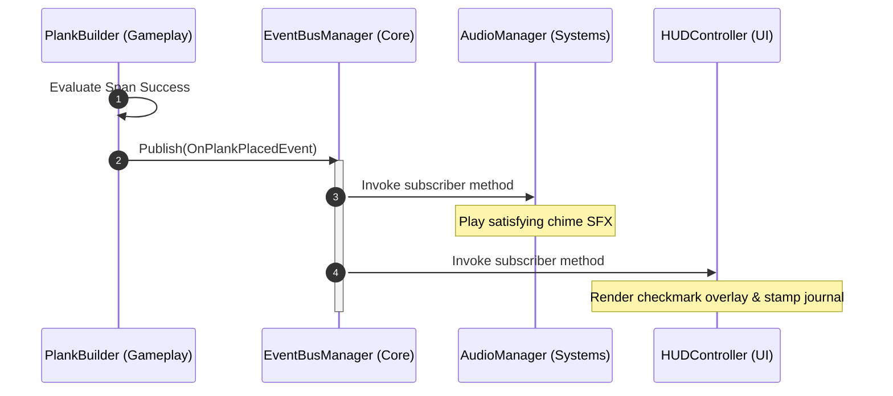

# Architectural Specification: Event Bus

* **Status**: APPROVED
* **Date**: 2026-07-09
* **Engine Focus**: Unity 6 LTS

---

## 1. Design Intent & Requirements Traceability

The Event Bus acts as the central, decoupled messaging system of QuestBit. It allows independent subsystems to communicate without direct dependencies:

* **Pillar Decoupling & Modular Expansion (Vision §1 & GDD §1.3)**: Adding a new subject biome (e.g., Year 2 Clockwork Marsh) must not require changing the core UI, Audio, or Save system scripts. Subsystems communicate by publishing and subscribing to typed events.
* **Low-End Hardware Smooth Frame Rates (Vision §2 & GDD §1.2)**: Main gameplay loops must run at a smooth, constant frame rate. The Event Bus must execute dispatches with **zero runtime GC allocations** and an **execution budget of <0.1ms per event**.
* **Accessibility Settings Synchronization (Vision §8 & GDD Ch. 15)**: Changes in UI accessibility options (e.g., enabling "Calm Visuals" or switching to Dyslexia-Optimized fonts) must propagate instantly to all active scenes, rendering pipelines, and dialogue handlers.

---

## 2. Event Registry & Class Contracts

To achieve zero allocation, the Event Bus utilizes static generic class caching (`EventRegistry<T>`). By caching listeners in generic classes, the compiler handles type matching at compile time. This avoids dictionary lookups, boxing/unboxing value types, and reflection.

### 2.1 Core Contracts (`IEvent` and Interface)

```csharp
using System;

namespace QuestBit.Core.EventBus
{
    /// <summary>
    /// Base interface for all message payloads passing through the Event Bus.
    /// Payload implementations must be declared as structs to prevent garbage collection allocation.
    /// </summary>
    public interface IEvent { }

    /// <summary>
    /// Interface defining the Event Bus API. Registered as a Singleton in the DI container.
    /// </summary>
    public interface IEventBus
    {
        void Subscribe<T>(Action<T> listener) where T : struct, IEvent;
        void Unsubscribe<T>(Action<T> listener) where T : struct, IEvent;
        void Publish<T>(T eventData) where T : struct, IEvent;
    }
}
```

### 2.2 Event Bus Implementation

```csharp
using System;
using System.Collections.Generic;
using UnityEngine;

namespace QuestBit.Core.EventBus
{
    public class EventBusManager : IEventBus
    {
        // 1. Static generic cache to store listeners for each specific event type.
        // Static class instantiation is handled once per type T by the runtime.
        private static class EventRegistry<T> where T : struct, IEvent
        {
            public static readonly List<Action<T>> Listeners = new List<Action<T>>(16);
        }

        public void Subscribe<T>(Action<T> listener) where T : struct, IEvent
        {
            if (listener == null) throw new ArgumentNullException(nameof(listener));
            
            var list = EventRegistry<T>.Listeners;
            if (!list.Contains(listener))
            {
                list.Add(listener);
            }
        }

        public void Unsubscribe<T>(Action<T> listener) where T : struct, IEvent
        {
            if (listener == null) throw new ArgumentNullException(nameof(listener));

            var list = EventRegistry<T>.Listeners;
            list.Remove(listener);
        }

        public void Publish<T>(T eventData) where T : struct, IEvent
        {
            var list = EventRegistry<T>.Listeners;
            
            // Loop backwards to allow listeners to safely unsubscribe themselves during execution.
            for (int i = list.Count - 1; i >= 0; i--)
            {
                try
                {
                    list[i].Invoke(eventData);
                }
                catch (Exception ex)
                {
                    Debug.LogError($"[EventBus] Exception caught in handler for event {typeof(T).Name}: {ex.Message}\n{ex.StackTrace}");
                }
            }
        }
    }
}
```

---

## 3. Strongly-Typed Event Payloads

Every event must be declared as a `struct` implementing `IEvent` to ensure it is allocated on the stack (zero GC impact). Below are the core event payloads mapping directly to GDD requirements.

### 3.1 Gameplay Event Payloads (GDD §2.4)
```csharp
namespace QuestBit.Gameplay.Events
{
    // Tidewell Cove Math Action
    public struct OnPlankPlacedEvent : IEvent
    {
        public string GapId { get; }
        public float PlankLength { get; }
        public bool IsSuccessfulSpan { get; }
        public float RemainingGapWidth { get; }

        public OnPlankPlacedEvent(string gapId, float plankLength, bool isSuccessful, float remainingWidth)
        {
            GapId = gapId;
            PlankLength = plankLength;
            IsSuccessfulSpan = isSuccessful;
            RemainingGapWidth = remainingWidth;
        }
    }

    // Inkwood Literacy Action
    public struct OnPhonemeBlendedEvent : IEvent
    {
        public string WordBlended { get; }
        public bool IsWordCorrect { get; }
        public string ActiveNodeId { get; }

        public OnPhonemeBlendedEvent(string word, bool isCorrect, string nodeId)
        {
            WordBlended = word;
            IsWordCorrect = isCorrect;
            ActiveNodeId = nodeId;
        }
    }
}
```

### 3.2 Accessibility Event Payloads (GDD Ch. 15)
```csharp
namespace QuestBit.UI.Events
{
    public struct OnAccessibilitySettingsChangedEvent : IEvent
    {
        public bool IsDyslexicFontEnabled { get; }
        public float TextSizeModifier { get; }
        public bool IsCalmVisualModeActive { get; }
        public bool IsSwitchScanEnabled { get; }

        public OnAccessibilitySettingsChangedEvent(bool dyslexicFont, float size, bool calmVisuals, bool switchScan)
        {
            IsDyslexicFontEnabled = dyslexicFont;
            TextSizeModifier = size;
            IsCalmVisualModeActive = calmVisuals;
            IsSwitchScanEnabled = switchScan;
        }
    }
}
```

---

## 4. Architectural Sequence Diagram: Decoupled Interaction

This diagram shows how a math bridge action publishes an event, triggering audio and UI feedback independently without direct code binding.



---

## 5. Failure Modes & Edge Cases

### 1. MonoBehaviour Unsubscription Memory Leaks
* **Symptom**: Memory consumption increases during play sessions. When a biome scene is unloaded, game objects are destroyed, but C# delegates remain in the `EventRegistry<T>` list, preventing the Garbage Collector from freeing the scene memory.
* **Mitigation / Coding Standard**: MonoBehaviours must subscribe in `OnEnable()` and unsubscribe in `OnDisable()`. If a MonoBehaviour is destroyed without unsubscribing, calling the delegate throws NREs. The loop catch-blocks prevent these exceptions from crashing other systems, but strict QA checks must run to log leaky classes.

```csharp
private void OnEnable()
{
    _eventBus.Subscribe<OnPlankPlacedEvent>(HandlePlankPlaced);
}

private void OnDisable()
{
    _eventBus.Unsubscribe<OnPlankPlacedEvent>(HandlePlankPlaced);
}
```

### 2. Nested Publishing Infinite Loops (Stack Overflow)
* **Symptom**: Game freezes or crashes instantly with a `StackOverflowException`.
* **Cause**: Class A handles Event X and publishes Event Y. Class B handles Event Y and publishes Event X.
* **Mitigation**: The Event Bus logs a warning if event call nesting depth exceeds **5 levels**. In critical paths, developers must queue events for execution in the next frame using a buffered Queue or UniTask delayed action instead of direct nested publishing.

---

## 6. Verification & Performance Validation

1. **Zero-Allocation Throughput Test (Unity Profiler)**:
   A PlayMode integration test publishes **100,000 events** sequentially. The test validates:
   * **GC Allocated Memory**: Exactly **0 bytes**.
   * **Time Spent**: Less than **5 milliseconds** total execution time (<0.05 microseconds per event dispatch).

2. **Leaked Listener Validation**:
   Upon scene transition, a validation script checks all static `EventRegistry<T>.Listeners` lists. If a listener target points to a destroyed `UnityEngine.Object`, it logs a high-severity error in CI containing the name of the leaked object.
