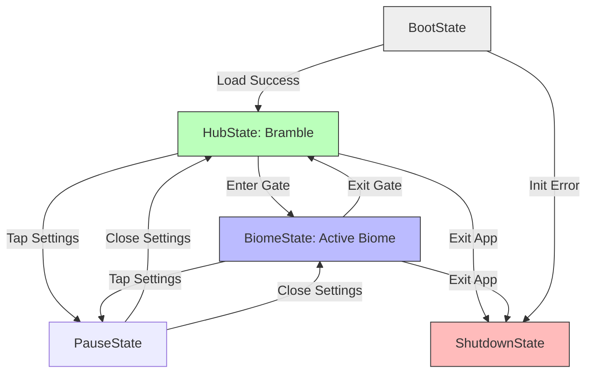

# Architectural Specification: State Machine Framework

* **Status**: APPROVED
* **Date**: 2026-07-09
* **Engine Focus**: Unity 6 LTS

---

## 1. Design Intent & Requirements Traceability

The State Machine Framework orchestrates high-level game states, scene loading boundaries, and menu configurations. It provides a structured, predictable pathway for session flow:

* **No Game-Over Cozy Flow (Vision §2 & GDD §2.3)**: Since QuestBit rejects traditional fail states or lives counters, the state machine manages soft retries in-place, allowing seamless state transitions between navigation and puzzle spaces.
* **Child Safety and Telemetry Flush (Vision §5 & GDD §16)**: On game suspension or shutdown, the state machine must transition to a clean exit state that flushes local telemetry queues and persists encrypted files before the process terminates.
* **Low-End Memory Management (Vision §2 & GDD §22)**: When transitioning between states (e.g., from Tidewell Cove to Inkwood), the state machine manages memory unloading boundaries to prevent memory overhead crashes on lower-end devices.

---

## 2. State Machine Interface Contracts

To achieve high-performance and zero allocation at runtime, all state instances are instantiated and cached in the Dependency Injection container during scene load. Transitions are performed by switching between cached references.

### 2.1 Interface Definitions

```csharp
namespace QuestBit.Core.StateMachine
{
    /// <summary>
    /// Base interface for all states in the system.
    /// </summary>
    public interface IState
    {
        void Enter();
        void Tick(float deltaTime);
        void Exit();
    }

    /// <summary>
    /// Extension for states that manage nested child states (Hierarchical States).
    /// </summary>
    public interface IExposedState : IState
    {
        IState? ParentState { get; set; }
        IState? CurrentSubState { get; }
        void SetSubState(IState subState);
    }

    /// <summary>
    /// Primary state engine contract. Registered as a Singleton in the DI container.
    /// </summary>
    public interface IStateMachine
    {
        IState CurrentState { get; }
        void Initialize(IState initialState);
        void TransitionTo<T>() where T : class, IState;
        void Tick(float deltaTime);
    }
}
```

### 2.2 Framework Implementation

```csharp
using System;
using System.Collections.Generic;
using UnityEngine;
using VContainer;

namespace QuestBit.Core.StateMachine
{
    public class StateMachineManager : IStateMachine
    {
        private readonly IObjectResolver _resolver;
        private readonly Dictionary<Type, IState> _stateCache = new Dictionary<Type, IState>(12);
        
        public IState CurrentState { get; private set; } = null!;

        [Inject]
        public StateMachineManager(IObjectResolver resolver)
        {
            _resolver = resolver;
        }

        public void Initialize(IState initialState)
        {
            CurrentState = initialState;
            CacheState(initialState);
            CurrentState.Enter();
        }

        public void TransitionTo<T>() where T : class, IState
        {
            var targetType = typeof(T);
            
            // Retrieve state from DI container cache or instantiate it once
            if (!_stateCache.TryGetValue(targetType, out var nextState))
            {
                nextState = _resolver.Resolve<T>();
                _stateCache[targetType] = nextState;
            }

            Debug.Log($"[StateMachine] Transitioning: {CurrentState.GetType().Name} -> {targetType.Name}");
            
            CurrentState.Exit();
            CurrentState = nextState;
            CurrentState.Enter();
        }

        public void Tick(float deltaTime)
        {
            CurrentState?.Tick(deltaTime);
        }

        private void CacheState(IState state)
        {
            var type = state.GetType();
            if (!_stateCache.ContainsKey(type))
            {
                _stateCache[type] = state;
            }
        }
    }
}
```

---

## 3. Game Flow States Specification

The application runs on five primary global states, managed by the root State Machine.

### 3.1 Global State Definitions

1. **`BootState`**:
   * *Tasks*: Initializes local files, loads localization keys, sets up DI bindings, and configures rendering resolutions.
   * *Exit Action*: Transitions automatically to `HubState` once basic settings load.
2. **`HubState` (Bramble Hub)**:
   * *Tasks*: Loads the persistent overworld overworld. Activates player locomotion and loads async cooperative plaques.
   * *Exit Action*: Transitions to `BiomeState` when entering a gate.
3. **`BiomeState` (Active Biome)**:
   * *Sub-states*: `BiomeLoadingState` (Addressables load), `BiomeExploreState` (Active traversal), `BiomePuzzleState` (Craft tool active), `BiomeDialogueState` (Narrative camera track).
   * *Exit Action*: Unloads biome assets and returns to `HubState` on exit.
4. **`PauseState`**:
   * *Tasks*: Halts gameplay tick updates. Instantiates the settings UI and locks player input scan maps.
   * *Exit Action*: Restores previous state on resume.
5. **`ShutdownState`**:
   * *Tasks*: Displays a calm closing animation, saves progress, flushes telemetry data to local storage, and terminates cleanly.

---

## 4. State Transition Matrix

The table below governs valid state transitions. The State Machine checks this matrix before allowing a transition request, preventing illegal operations:

| Current State | Target: Boot | Target: Hub | Target: Biome | Target: Pause | Target: Shutdown |
| :--- | :---: | :---: | :---: | :---: | :---: |
| **BootState** | No | **YES** | No | No | **YES** |
| **HubState** | No | No | **YES** | **YES** | **YES** |
| **BiomeState** | No | **YES** | No | **YES** | **YES** |
| **PauseState** | No | **YES** | **YES** | No | **YES** |
| **ShutdownState**| No | No | No | No | No |

### Transition Flowchart



---

## 5. State Serialization & Loading Boundaries

Transitions between large scenes (`HubState` -> `BiomeState`) must manage asset memory boundaries to prevent OOM errors:

1. **Transition Initialization**: The State Machine enters a loading sequence, bringing up `Loading.unity` additively.
2. **Telemetry Flush**: Save progress locally before initiating the load.
3. **Asset Release**: Unload the previous scene's Addressable bundles. Run `Resources.UnloadUnusedAssets` and trigger the C# Garbage Collector.
4. **Async Load**: Stream the new biome scene asynchronously via `UniTask`.
5. **Initialization**: Initialize the scene's dependencies and transition to the active state.

---

## 6. Failure Modes & Edge Cases

### 1. Illegal Transitions
* **Symptom**: Dialogue script attempts to trigger a direct transition to `BootState` from `BiomeState`.
* **Prevention**: The `TransitionTo<T>` implementation checks the transition matrix. If an invalid transition is requested, it throws a compile-time check warning or logs a high-priority warning in the debugger without executing the transition.

### 2. Shutdown Interruption / App Suspend
* **Symptom**: The player exits the game on mobile by swiping home. The game process is terminated by the OS before the state machine can transition to `ShutdownState`, causing save data loss.
* **Mitigation**: Hook into Unity's `OnApplicationPause(bool pauseStatus)` and `OnApplicationFocus(bool focusStatus)`. If the game is paused, immediately trigger a mini-save operation to persist gameplay progress.

### 3. Load Failure during Biome Stream
* **Symptom**: Scene loading stalls at 99% due to network loss.
* **Mitigation**: Set a **15-second loading timeout**. If the timeout is reached, display a localized error banner, cancel the scene load, and transition back to `HubState` to keep the player from getting stuck.

---

## 7. Verification & Automated Tests

1. **State Transition Validity Test**:
   An integration test runs all transitions in the State Machine. It validates that valid transitions succeed and illegal transitions throw warnings:

   ```csharp
   [Test]
   public void VerifyIllegalTransitionsAreBlocked()
   {
       var stateMachine = new StateMachineManager(mockResolver);
       stateMachine.Initialize(new HubState());

       // Attempting to transition from Hub to Boot is forbidden
       Assert.Throws<InvalidStateException>(() => {
           stateMachine.TransitionTo<BootState>();
       });
   }
   ```

2. **Save-State Verification**:
   Verify that transitioning to `ShutdownState` writes a valid, uncorrupted JSON save payload to disk.
