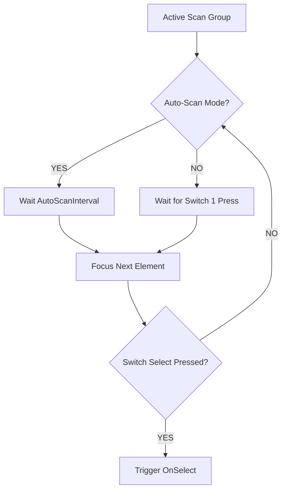

# Architectural Specification: Input Manager

* **Status**: APPROVED
* **Date**: 2026-07-09
* **Engine Focus**: Unity 6 LTS
* **Library Selection**: **Unity Input System (Modern Package)**

---

## 1. Design Intent & Requirements Traceability

The Input Manager translates physical device inputs (touch, controller, mouse, keyboards, assistive switches) into clean gameplay actions. It serves as a foundational pillar for our accessibility-first design:

* **Motor Accessibility (Vision §8 & GDD §15.2)**: Support for assistive inputs (switch-access) is a core launch requirement. The Input Manager must natively support single-switch and dual-switch scanning structures without requiring external middleware.
* **Low Locomotion Burden (GDD §2.2.1)**: Locomotion verbs must adapt to tap-to-move and automatic jog modes to eliminate the physical coordination burden of virtual analog sticks for younger players or those with motor constraints.
* **Observe Loupe Toggle (GDD §2.7 & §2.2.3)**: Support for holding or toggling the Observe Loupe through customizable mappings, adapting to cognitive and physical fatigue constraints.

---

## 2. Input Manager Interface Contracts

The input system decouples hardware-dependent actions from the gameplay engine by utilizing action maps and explicit registration interfaces for scanning targets.

### 2.1 Interface Definitions

```csharp
using System;
using UnityEngine;

namespace QuestBit.Systems.Input
{
    /// <summary>
    /// Supported input configurations.
    /// </summary>
    public enum ControlScheme
    {
        TouchScreen,
        GamePad,
        KeyboardMouse,
        SingleSwitchAutoScan,  // One physical button: cycles focus automatically
        DualSwitchManualScan   // Two physical buttons: Switch 1 = Next, Switch 2 = Select
    }

    /// <summary>
    /// Interface implemented by any UI component or world object that can be focused in a switch-scan loop.
    /// </summary>
    public interface IScanTarget
    {
        GameObject GameObject { get; }
        int ScanOrderPriority { get; }
        bool IsSelectable { get; }
        void OnFocusEnter();
        void OnFocusExit();
        void OnSelect();
    }

    /// <summary>
    /// Core Input Manager API. Registered as a Singleton in the DI container.
    /// </summary>
    public interface IInputManager
    {
        ControlScheme CurrentScheme { get; }
        event Action<ControlScheme> OnControlSchemeChanged;
        
        Vector2 GetMovementVector();
        bool IsObserveHeld();
        
        // Switch-Scan Interface methods
        void RegisterScanTarget(IScanTarget target);
        void UnregisterScanTarget(IScanTarget target);
        void SetScanPacing(float intervalSeconds);
        void TriggerSwitchTap(int switchIndex); // 0 = Next/Primary, 1 = Select
    }
}
```

### 2.2 Switch-Scan Configuration Data Schema

This C# struct maps the configurations for switch-scan setups, allowing parents to customize pacing.

```csharp
[System.Serializable]
public struct SwitchScanConfig
{
    public float AutoScanInterval;      // Pacing interval in seconds (default: 1.5s, range: 0.5s - 4.0s)
    public bool ReverseDirection;       // Reverse scan order direction
    public bool LoopSelections;         // Start over at index 0 after reaching the end of the group
    public float DebounceThresholdMs;   // Ignore rapid repeat inputs within this window (default: 150ms)
}
```

---

## 3. Switch-Scan Navigation Design

Switch-scan accessibility works by moving a visual focus cursor sequentially through interactive elements.



### 3.2 Switch Scan Controller Implementation

This module manages the focus loops and runs within our core input loop.

```csharp
using System.Collections.Generic;
using UnityEngine;
using QuestBit.Core.EventBus;

namespace QuestBit.Systems.Input
{
    public class SwitchScanController : MonoBehaviour
    {
        private readonly List<IScanTarget> _activeTargets = new List<IScanTarget>(32);
        private int _currentIndex = -1;
        private float _timer;
        
        [SerializeField] private SwitchScanConfig _config;
        private IEventBus _eventBus = null!;

        public void Initialize(IEventBus eventBus, SwitchScanConfig config)
        {
            _eventBus = eventBus;
            _config = config;
        }

        public void Register(IScanTarget target)
        {
            if (!_activeTargets.Contains(target))
            {
                _activeTargets.Add(target);
                // Re-sort list based on priority order
                _activeTargets.Sort((a, b) => a.ScanOrderPriority.CompareTo(b.ScanOrderPriority));
            }
        }

        public void Unregister(IScanTarget target)
        {
            if (_activeTargets.Remove(target))
            {
                ResetFocus();
            }
        }

        public void Tick(float deltaTime, bool isAutoScan)
        {
            if (_activeTargets.Count == 0) return;

            if (isAutoScan)
            {
                _timer += deltaTime;
                if (_timer >= _config.AutoScanInterval)
                {
                    _timer = 0f;
                    MoveNext();
                }
            }
        }

        public void MoveNext()
        {
            if (_activeTargets.Count == 0) return;

            // Remove focus from current target
            if (_currentIndex >= 0 && _currentIndex < _activeTargets.Count)
            {
                _activeTargets[_currentIndex].OnFocusExit();
            }

            // Move to next active target
            _currentIndex++;
            if (_currentIndex >= _activeTargets.Count)
            {
                _currentIndex = _config.LoopSelections ? 0 : _activeTargets.Count - 1;
            }

            _activeTargets[_currentIndex].OnFocusEnter();
        }

        public void TriggerSelect()
        {
            if (_currentIndex >= 0 && _currentIndex < _activeTargets.Count)
            {
                var target = _activeTargets[_currentIndex];
                if (target.IsSelectable)
                {
                    target.OnSelect();
                }
            }
        }

        private void ResetFocus()
        {
            _currentIndex = -1;
            _timer = 0f;
        }
    }
}
```

---

## 4. Input Latency & Processing Budget

* **Input Processing Target**: Single-frame input capture (**<16.6ms processing window at 60Hz**).
* **Double-Press Protection**: The input manager applies a **150ms hardware debounce threshold** to single-switch ports. If a child with spastic muscle control accidentally presses the switch twice rapidly, the second input is filtered out, preventing accidental double-activation.

---

## 5. Failure Modes & Edge Cases

### 1. Assistive Device Disconnection
* **Symptom**: A Bluetooth switch disconnects mid-game.
* **Mitigation**: Hook into the Input System's `InputSystem.onDeviceChange`. If an active switch device disconnects, the input manager immediately publishes a pause command to the **Event Bus**, shifting the game state to `PauseState` and displaying a localized reconnect screen.

### 2. Focus Hijack (Null Elements)
* **Symptom**: UI panel closes, but the focus pointer tries to highlight destroyed GameObjects.
* **Mitigation**: The `IScanTarget` list references objects cleanly. In `Unregister`, the controller validates reference lifetimes, removing dead targets from the list before updating the index.

### 3. Multiple Focus Registrations
* **Symptom**: Both the pause menu buttons and the gameplay background widgets try to capture the focus loop, creating chaotic scanning patterns.
* **Mitigation**: Active scan targets are grouped by **Scan Groups** (e.g. `UIPanel`, `WorldOverlay`). Only targets belonging to the highest-priority active scan group are included in the controller's active lists.

---

## 6. Verification & Automated UI Testing

1. **Virtual Switch Simulation Test**:
   An integration test sets the control scheme to `SingleSwitchAutoScan` with an auto-scan interval of 1.0 seconds. The test:
   * Asserts focus is on Target A at t=0.5s.
   * Asserts focus moves to Target B at t=1.5s.
   * Sends a simulated switch activation at t=1.8s.
   * Asserts Target B's `OnSelect` event fires.

2. **Debounce Logic Validation**:
   Assert that two switch activations sent within 50ms of each other trigger exactly one select callback, confirming that the 150ms debounce threshold is active.
