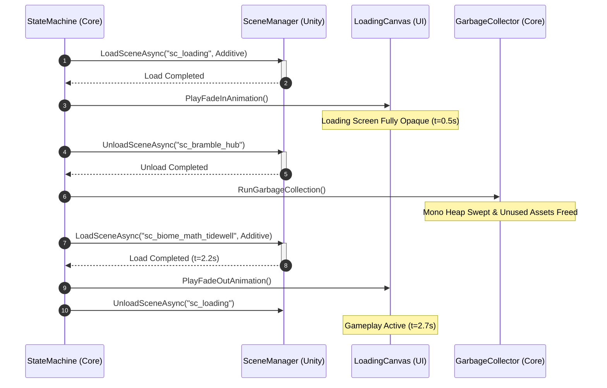

# Architectural Specification: Scene Structure & Loading Model

* **Status**: APPROVED
* **Date**: 2026-07-09
* **Engine Focus**: Unity 6 LTS

---

## 1. Design Intent & Requirements Traceability

The scene structure defines how Unity scenes are organized, loaded, streamed, and cached in memory. It directly realizes our core performance and narrative requirements:

* **Low-End Hardware Memory Safety (Vision §2 & GDD §1.2)**: Chromebooks and low-end tablets have strict system RAM bounds (<1.5GB total). The game must not load the entire world at once. Instead, it must utilize an additive streaming model to keep active scene footprint **under 200MB RAM**.
* **Cozy Visual Flow (Vision §6 & GDD §9.2)**: Scene transitions must feel natural and non-disruptive, utilizing themed, narrated storybook transition overlays that align with the art and audio philosophy rather than plain black screens.
* **Offline-First Fault Tolerance (Vision §5 & GDD §1.2)**: If streaming a biome scene fails due to file access or download interruptions, the system must recover gracefully without crashing the application.

---

## 2. Additive Scene Model

QuestBit implements a **Multi-Scene Additive Loading Architecture**. A single persistent scene manages core system dependencies, while visual and gameplay environments are loaded and unloaded dynamically.

### 2.1 Scene Definitions

1. **`sc_persistent` (Root Scene)**:
   * *Purpose*: Application container. Houses the VContainer `ProjectLifetimeScope` (DI), the main Camera Rig, the `IInputManager` listener, and the global `IEventBus`.
   * *Lifetime*: Loaded at startup (`sc_boot`) and remains active until the process terminates. Never unloaded.
2. **`sc_loading` (Additive Overlay)**:
   * *Purpose*: Covers transition phases. Contains rendering layers for animated storybook loading panels, text-to-speech narration, and dynamic tips.
   * *Lifetime*: Loaded additively during transitions and unloaded immediately after a target scene initializes.
3. **`sc_bramble_hub` (Overworld Hub)**:
   * *Purpose*: The main community space. Contains Mara's boathouse gate, local NPC nodes, and paths to other biomes.
4. **`sc_biome_math_tidewell` (Biome Scene)**:
   * *Purpose*: The Tideglass math gameplay scene. Loads sub-chunks dynamically based on the player's physical zone.
5. **`sc_biome_lit_inkwood` (Biome Scene)**:
   * *Purpose*: The Inkwood literacy gameplay scene.

---

## 3. Scene Hierarchy Layout

```text
Unity Scene Hierarchy (Runtime Active State Example)
├── sc_persistent [Active Parent]
│   ├── [SETUP]
│   │   ├── Main Camera
│   │   ├── ProjectLifetimeScope (DI Container)
│   │   └── SwitchScanInputManager
│   └── [UI]
│       └── Universal_HUD_Canvas
└── sc_biome_math_tidewell [Additive Child]
    ├── [WORLD_GEOMETRY]
    │   ├── Coastal_Terrain_Tilemap
    │   └── Water_Shader_Mesh
    ├── [LIGHTING]
    │   └── Ambient_Sunset_Volume
    └── [INTERACTABLES]
        ├── NPC_Mara
        └── Tool_Tideglass_Target_01
```

---

## 4. Transition Flow & Async Budgets

Transitions between worlds are governed by strict execution boundaries. Below are the resource allocations for low-end tablets:

* **Maximum Scene Transition Time**: **<3.0 seconds** on Chromebook baselines.
* **Maximum RAM Footprint during Transition**: **250MB** (including the Loading scene assets).
* **Garbage Collection (GC) trigger**: GC collections are forced during step 3 of the transition (while the loading screen is fully opaque) to prevent frame hiccups during active play.

### Scene Loading Sequence Diagram

This diagram displays the order of operations when transitioning from the Bramble hub to Tidewell Cove.



---

## 5. C# Transition API Interface

```csharp
using Cysharp.Threading.Tasks;

namespace QuestBit.Systems.Scene
{
    public interface ISceneTransitionManager
    {
        /// <summary>
        /// Asynchronously transitions from the current active scene to the target scene.
        /// Handles loading overlays, memory purging, and GC collection under strict time budgets.
        /// </summary>
        /// <param name="targetSceneAddressableKey">Addressable key of the target scene.</param>
        /// <returns>UniTask returning success result.</returns>
        UniTask<Result<bool>> TransitionToSceneAsync(string targetSceneAddressableKey);
    }
}
```

---

## 6. Failure Modes & Edge Cases

### 1. Addressable Scene Load Failures (Asset Corrupt / Missing)
* **Symptom**: Player transitions to a new biome, the loading screen gets stuck at 99%, or the load fails, leaving the screen permanently blocked.
* **Mitigation**: Implement a **15-second loading timeout**. If the scene load fails or times out, the transition manager:
  1. Aborts the scene loading task.
  2. Dispatches a high-priority warning to the **Event Bus**.
  3. Transitions the player back to `sc_bramble_hub` (which is stored in the local base build binary, ensuring it is always loadable).
  4. Fades out the loading screen and presents a localized error banner ("Could not reach the beach, returning home").

### 2. Double-Trigger Loading Calls
* **Symptom**: A player double-taps a transition trigger zone, causing the State Machine to initiate two concurrent loading processes for the same scene, crashing the Unity loading pipeline.
* **Mitigation**: The `ISceneTransitionManager` maintains a boolean lock `_isTransitioning`. If a load request is received while `_isTransitioning` is true, the request is immediately ignored.

### 3. Audio Continuity Interruption
* **Symptom**: Ambient music abruptly cuts off or pops during scene unload.
* **Mitigation**: The `IAudioManager` handles ambient music routing globally in the persistent scene. The transition manager passes a fade-out directive to the music bus at step 1 of the load, fading the current track down over 0.5s and fading the new track up when step 5 is entered, preserving acoustic coziness.

---

## 7. Verification & Profiling Tests

1. **OOM Resilience Test (Transition Loop)**:
   An automated integration test runs a loop that loads `sc_bramble_hub`, transitions to `sc_biome_math_tidewell`, transitions back to `sc_bramble_hub`, and then transitions to `sc_biome_lit_inkwood`. The loop executes **50 times** continuously.
   * *Pass Criteria*: System memory allocation must remain stable (no memory leak exceeding **5MB** baseline) and the app must not trigger OS-level OOM crashes.

2. **Timeout Recovery Test**:
   Simulate a network timeout during biome streaming. Verify that the system safely recovers and redirects the player to the Bramble hub within the 15-second window.
