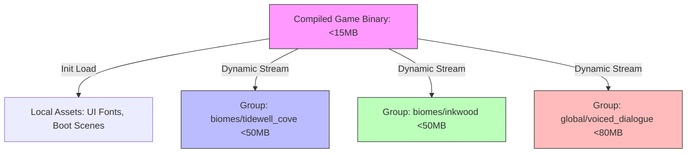

# Architectural Specification: Asset Pipeline & Bundling Strategy

* **Status**: APPROVED
* **Date**: 2026-07-09
* **Engine Focus**: Unity 6 LTS
* **Package Focus**: **Unity Addressable Asset System**

---

## 1. Design Intent & Requirements Traceability

The Asset Pipeline manages how graphic, 3D, and audio source assets are imported, compressed, packaged, and distributed. It directly addresses the target platform and network boundaries:

* **School Chromebook Storage Bounds (GDD §1.2 & §1.4)**: School district devices are often disk-space constrained and run WebGL builds inside browser cache profiles. The initial application payload must be **under 15MB**, and the total project size must be **under 500MB**, with individual biome bundles constrained to **under 50MB**.
* **Offline-First Playability (Vision §5 & GDD §1.2)**: Once a child has loaded a biome, its asset bundles must be stored in the local persistent storage cache. The game must run fully offline without re-downloading assets on subsequent launches.
* **Stylized 2.5D Art Fidelity (Vision §6 & GDD §3.2)**: The pipeline must preserve the hand-painted, storybook quality of our textures while applying high-ratio compression algorithms to fit within hardware RAM limits.

---

## 2. Automated Import Settings (Unity Editor Presets)

To prevent human error and keep asset formats consistent, QuestBit utilizes automated import rules. C# `AssetPostprocessor` classes apply these configurations upon asset ingestion.

### 2.1 Asset Settings Profile Registry

| Asset Path | Target Category | Import Rule | Target Format / Presets |
| :--- | :--- | :--- | :--- |
| `_Project/Art/Textures/UI/` | UI Sprite | No Mipmaps, 2D sprite mode | **ASTC 4x4** (Mobile), **WebP** (WebGL) |
| `_Project/Art/Textures/3D/` | Mesh Texture | Generate Mipmaps, Aniso Level = 2 | **ASTC 6x6** (Mobile), **WebP Crunched** (WebGL) |
| `_Project/Audio/SFX/` | Sound Effects | Load type: Decompress On Load | **WAV** (Uncompressed 16-bit PCM) |
| `_Project/Audio/VO/` | Voiceover Dialogue | Load type: Streaming, compressed | **Ogg Vorbis** (Quality: 40%) |
| `_Project/Art/Models/` | 3D Meshes | Scale Factor = 1, Turn off Blendshapes | Optimize Mesh, Weld Vertices, Strip Lightmap UVs |

### 2.2 Automated Asset Postprocessor Script

This C# script runs inside the Unity Editor during asset compilation, automatically applying the specified compression settings based on the target folder.

```csharp
#if UNITY_EDITOR
using UnityEditor;
using UnityEngine;

namespace QuestBit.Editor.Pipeline
{
    public class AssetImportPipeline : AssetPostprocessor
    {
        // Automatically intercept texture imports to enforce WebGL and mobile memory boundaries
        private void OnPreprocessTexture()
        {
            var importer = (TextureImporter)assetImporter;

            // 1. Check if the texture is a UI element
            if (assetPath.Contains("/Textures/UI/"))
            {
                importer.textureType = TextureImporterType.Sprite;
                importer.spriteImportMode = SpriteImportMode.Single;
                importer.mipmapEnabled = false; // Mipmaps are wasteful for 2D UI
                importer.filterMode = FilterMode.Bilinear;
            }
            // 2. Check if the texture is a 3D environment asset
            else if (assetPath.Contains("/Textures/3D/"))
            {
                importer.textureType = TextureImporterType.Default;
                importer.mipmapEnabled = true;
                importer.filterMode = FilterMode.Bilinear;
                importer.anisoLevel = 2;
            }

            ConfigurePlatformCompression(importer);
        }

        private void ConfigurePlatformCompression(TextureImporter importer)
        {
            // Configure WebGL specific WebP Crunch Settings
            var webGLSettings = new TextureImporterPlatformSettings
            {
                name = "WebGL",
                overridden = true,
                format = TextureImporterFormat.DXT5Crunched, // Fallback DXT compressed format
                compressionQuality = 50,
                maxTextureSize = 1024
            };
            importer.SetPlatformTextureSettings(webGLSettings);

            // Configure Mobile (iOS/Android) ASTC settings
            var mobileSettings = new TextureImporterPlatformSettings
            {
                name = "Android",
                overridden = true,
                format = TextureImporterFormat.ASTC_6x6, // High compression ratio ASTC format
                compressionQuality = 100,
                maxTextureSize = 2048
            };
            importer.SetPlatformTextureSettings(mobileSettings);
        }
    }
}
#endif
```

---

## 3. Remote Addressables Strategy

QuestBit utilizes Unity's **Addressable Asset System** to segment runtime assets into distinct download packages.

### 3.1 Addressables Group Architecture



### 3.2 Hosting and Versioning Configuration
* **Hosting Provider**: Google Cloud Storage (GCS) Bucket acting as a static content delivery network (CDN).
* **Versioning System**: Content Catalog files are named with unique hashes (`catalog_[hash].json`). At startup, the persistent root scene fetches the remote hash. If the hashes do not match, it downloads only the changed bundles.

---

## 4. Offline Caching Model

Addressable bundles must remain accessible when the user is disconnected:

1. **Local Persistent Cache**: Unity's `Caching` system is configured to allocate up to **500MB** of local storage in IndexedDB (WebGL) or Application persistent data paths (mobile).
2. **Pre-caching Interface**: The Hub world provides a Parent Portal option to pre-download all biomes while on home Wi-Fi, allowing parents to prepare the device for travel (Vision §10).
3. **No Network Fallback**: The Addressables initialization checks `Application.internetReachability`. If offline, it sets `Caching.db` to read-only local access, forcing the engine to load cached bundles without contacting the CDN bucket.

---

## 5. Failure Modes & Edge Cases

### 1. WebGL IndexedDB Storage Quotas Reached
* **Symptom**: Browser throws `QuotaExceededError` during biome loading.
* **Cause**: Chromebook user profile has exceeded the storage capacity allocated by the browser sandbox.
* **Mitigation**: Implement a cache pruning service. Before loading a new biome, the transition manager checks local cache size. If it exceeds 400MB, it unloads and purges the least-recently used (LRU) biome bundle from cache before starting the download.

### 2. Bundle Hash Mismatch (Corrupt Downloads)
* **Symptom**: Load screen halts at 50% or the scene spawns with pink textures.
* **Mitigation**: Enable **CRC (Cyclic Redundancy Check)** verification on all remote Addressable groups. If a downloaded bundle fails CRC verification, delete the corrupt cached file and trigger a redownload. If the second attempt fails, transition the player to `sc_bramble_hub` with a warning.

### 3. Cache Purge by browser
* **Symptom**: Returning school players experience slow loading times because the browser has cleared IndexedDB cache overnight.
* **Mitigation**: Configure the loading screen to explain that the game is downloading assets, utilizing a friendly animation. Display a warning if the download takes longer than 10 seconds.

---

## 6. Verification & Automated CI/CD Auditing

1. **Size Constraints Verification (CI Pipeline)**:
   A GitHub runner executes an automated script (`tools/asset_checker.py`) that checks compiled build sizes:
   * Asserts the main app executable size is **<15MB**.
   * Asserts no individual `.bundle` file in `biomes/` exceeds **50MB**.
   * Asserts all textures in `Textures/3D/` have dimensions that are powers of two (required for ASTC compression).

2. **LOD and Mipmap Verification**:
   Editor tests verify that all textures in `UI/` folders have the `Generate Mip Maps` setting disabled, saving 33% texture memory overhead per sprite.
