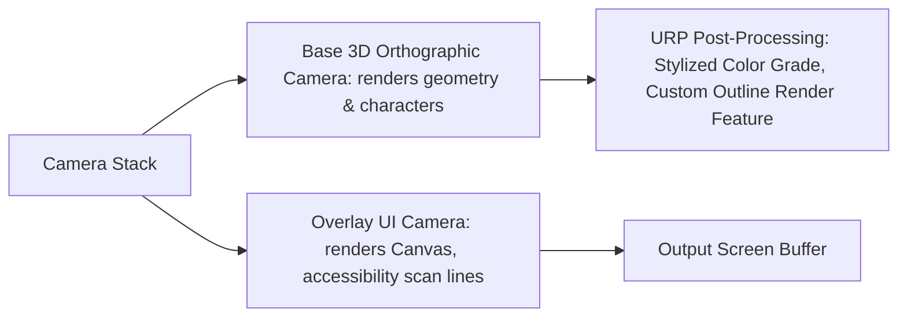

# Architectural Specification: Rendering Pipeline & Visual Pacing

* **Status**: APPROVED
* **Date**: 2026-07-09
* **Engine Focus**: Unity 6 LTS
* **Render Pipeline**: **Universal Render Pipeline (URP)**

---

## 1. Design Intent & Requirements Traceability

The rendering pipeline dictates how 3D assets, 2D planes, lighting, and post-processing effects are processed on GPU. It must directly align artistic style with strict hardware limits:

* **Stylized Storybook Aesthetics (Vision §6 & GDD §3.2)**: Render custom, hand-painted texture maps with flat/stylized shading, soft shadow falloffs, and a custom edge-glow shader that communicates the cozy Zelda/Pixar art style.
* **Low-End Tablet and Chromebook Performance (Vision §2 & GDD §1.2 & §22)**: Chromebook integrated GPUs (Intel HD Graphics) and low-end tablet chips (Mali/PowerVR) have low fill rates and memory bandwidth. The pipeline must restrict rendering batches to **<120 draw calls** and screen triangles to **<150,000**.
* **Calm Mode Visual Filtering (Vision §8 & GDD §15.4)**: The render pipeline must support a "Calm Visuals" toggle that disables high-frequency screen space particles, disables camera shakes, and filters post-processing bloom levels to support neurodivergent players.

---

## 2. Pipeline Configuration: Stylized 2.5D URP

To achieve a 2.5D look (3D characters moving on a 2D orthographic plane with layered parallax backgrounds), QuestBit configures URP with a **Forward Rendering Path** using custom camera stacking.

### 2.1 Camera Stack Configuration



### 2.2 Custom URP Scriptable Render Features

1. **Observe Loupe Outline Pass (`ObserveLoupeRenderFeature`)**:
   * *Trigger*: Activated when the player holds the "Observe" verb (GDD §2.2.3).
   * *Behavior*: Executes a fullscreen blit pass that dims the screen buffer color by 40% and overlays an unlit, high-intensity color glow outline on objects tagged with the `Interactable` layer.
2. **Dynamic UI Focus Overlay**:
   * *Behavior*: Renders accessibility scan focus highlights directly onto the screen buffer, ensuring outlines remain sharp at all display resolutions.

---

## 3. Resolution and Performance Budgets

To prevent thermal throttling and ensure stable frame rates (60 FPS target on standard iPad, 30 FPS minimum on Chromebook WebGL), target specifications are locked:

### 3.1 Performance Budget Specification

| Target Platform | Resolution Target | Frame Rate | Max Draw Calls (Batches) | Max Triangle Count | Post-Processing Profile |
| :--- | :--- | :---: | :---: | :---: | :--- |
| **WebGL Chromebook** | 1280x720 (720p) | 30 FPS | **100** | **100,000** | Anti-Aliasing (FXAA), Color Grading (LUT) |
| **Tablet (iPad 9 / Android)** | 1920x1080 (1080p) | 60 FPS | **120** | **150,000** | FXAA, Soft Vignette, LUT |
| **Smart TV / Console** | 1920x1080 (1080p) | 60 FPS | **150** | **250,000** | SMAA, Vignette, Bloom, LUT |

### 3.2 Overdraw and Fill-Rate Bounds
* **UI Batching Rule**: All UI icons must reside on unified **2048x2048 Texture Atlases** to prevent batch breaking.
* **Alpha Blending Restriction**: Multiple overlapping transparent textures (e.g. layers of water foam or particle clouds) are restricted to a maximum depth of **3 layers** to prevent fill-rate bottlenecks.

---

## 4. Calm Mode Visual Filtering Implementation

The "Calm Visuals" accessibility toggle (GDD §15.2) modifies rendering parameters at runtime without requiring a scene reload.

```csharp
using UnityEngine;
using QuestBit.Core.EventBus;
using QuestBit.UI.Events;

namespace QuestBit.Gameplay.Rendering
{
    public class CalmModeRenderController : MonoBehaviour
    {
        [SerializeField] private ParticleSystem[] _backgroundParticleSystems = null!;
        [SerializeField] private UnityEngine.Rendering.Volume _postProcessingVolume = null!;
        
        private IEventBus _eventBus = null!;

        public void Initialize(IEventBus eventBus)
        {
            _eventBus = eventBus;
            _eventBus.Subscribe<OnAccessibilitySettingsChangedEvent>(OnAccessibilityChanged);
        }

        private void OnDestroy()
        {
            _eventBus?.Unsubscribe<OnAccessibilitySettingsChangedEvent>(OnAccessibilityChanged);
        }

        private void OnAccessibilityChanged(OnAccessibilitySettingsChangedEvent eventData)
        {
            ToggleCalmVisuals(eventData.IsCalmVisualModeActive);
        }

        public void ToggleCalmVisuals(bool enabled)
        {
            // 1. Disable or enable all background environmental particle systems (fireflies, dust motes)
            foreach (var ps in _backgroundParticleSystems)
            {
                if (ps == null) continue;
                
                var emission = ps.emission;
                emission.enabled = !enabled; // Turn off emission in Calm Mode
            }

            // 2. Adjust Post-Processing volume settings (reduce bloom brightness, disable camera shakes)
            if (_postProcessingVolume.profile.TryGet<UnityEngine.Rendering.Universal.Bloom>(out var bloom))
            {
                // Cap bloom intensity to prevent sensory overstimulation
                bloom.intensity.Override(enabled ? 0.0f : 0.8f);
            }

            // 3. Inform the Camera Shake Controller to mute all screen shake triggers
            CameraShakeController.MuteShake = enabled;

            Debug.Log($"[Rendering] Calm Visuals Mode set to: {enabled}");
        }
    }
}
```

---

## 5. Failure Modes & Edge Cases

### 1. WebGL Shader Compilation Stalls (Browser Freeze)
* **Symptom**: Browser freezes for up to 5 seconds when loading a biome scene for the first time.
* **Cause**: WebGL compiles shaders at runtime when they are first exposed to camera view. Complex Shader Graphs cause JIT compiling stalls in the browser thread.
* **Mitigation**: Implement a **Shader Warmup List** (`ShaderVariantCollection`). During the boot scene sequence, compile all required materials in the background while the loading screen is active, ensuring zero compile stalls occur during active gameplay traversal.

### 2. Standard Shader Fallbacks (Pink Materials)
* **Symptom**: Materials render as bright magenta on older Chromebook models.
* **Cause**: The GPU does not support custom URP features or complex lighting passes.
* **Mitigation**: Create simple, unlit fallback shaders inside the Shader Graph. If the client GPU fails URP profile verification, fall back to a flat-shaded mobile shader.

---

## 6. Verification & Performance Profiling

1. **Draw Call Validation (Unity Frame Debugger)**:
   Build a verification script that captures the rendering pipeline status on target scenes.
   * *Pass Criteria*: Under exploration paths, the total batch count must not exceed **120 batches** (with static batching enabled).

2. **Calm Mode Assertions**:
   Verify that dispatching the `OnAccessibilitySettingsChangedEvent` with `IsCalmVisualModeActive = true` changes the status of active particle systems to `emission.enabled = false` within a single frame, and locks the camera shake controller.
