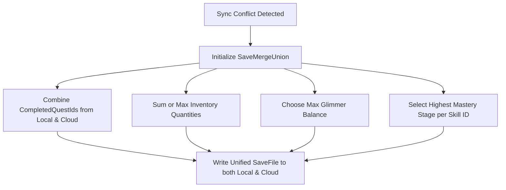

# Architectural Specification: Save System

* **Status**: APPROVED
* **Date**: 2026-07-09
* **Engine Focus**: Unity 6 LTS

---

## 1. Design Intent & Requirements Traceability

The Save System handles local progress serialization, data encryption, and cloud synchronization. It must strictly conform to our child-safety and anxiety-free design laws:

* **No Streak Shaming (Vision §2 & §11)**: The calendar and progression states must only record positive milestones. Gaps or missed days are not stored or tracked in the data schema, ensuring a child is welcomed back without guilt.
* **Child-Data Privacy (Vision §5 & §9 & GDD §1.2 & §15.2)**: To ensure compliance with COPPA and GDPR-K, the save data contains **zero Personally Identifiable Information (PII)**. There are no fields for email addresses, real names, or precise locations. Cloud sync is disabled by default, requiring a parent-gated PIN to activate.
* **Non-Punitive Conflict Resolution (Vision §2 & GDD §2.3)**: When syncing an offline local save with the cloud database, conflicts must be resolved using a **Cumulative Progress Merge-Union**. Quest completions, inventory items, and mastery steps are merged together, and currency values use the higher of the two, guaranteeing progress is never lost.

---

## 2. Save Game Data Schema (JSON Spec)

The following schema represents the serializable data structure of a QuestBit save file.

```json
{
  "saveVersion": 4,
  "timestamp": 1783597600,
  "playerProfile": {
    "avatarConfiguration": {
      "hairStyleId": "hair_curly_02",
      "skinColorHex": "#E0A96D",
      "outfitId": "outfit_wayfinder_default"
    },
    "glimmerCurrency": 450,
    "sparkConfiguration": {
      "elementalType": "spark_water",
      "evolutionTier": 2,
      "unlockedVisuals": ["spark_water_base", "spark_water_t1_bubble"]
    }
  },
  "masteryEngineState": {
    "skills": [
      { "id": "math_fraction_halves", "stage": 4, "lastAttemptTimestamp": 1783597000 },
      { "id": "math_fraction_quarters", "stage": 2, "lastAttemptTimestamp": 1783597200 },
      { "id": "lit_blend_cvc", "stage": 5, "lastAttemptTimestamp": 1783596500 }
    ],
    "clueJournalStamps": ["stamp_first_half", "stamp_mara_boat_solved"]
  },
  "questState": {
    "activeQuests": [
      { "id": "quest_cove_market_tangle", "activeObjectiveIndex": 2 }
    ],
    "completedQuestIds": ["quest_cove_washed_shore", "quest_cove_halfway_dock"]
  },
  "inventoryState": {
    "questSlots": [
      { "itemId": "item_mara_hook_replica", "quantity": 1 }
    ],
    "infiniteMaterials": [
      { "itemId": "material_driftwood", "quantity": 27 },
      { "itemId": "material_reed_fiber", "quantity": 12 }
    ]
  },
  "socialData": {
    "unlockedCosmeticGifts": ["gift_ferro_knot_charm"],
    "communityContributions": {
      "cove_long_dock_spans_helped": 4
    }
  }
}
```

---

## 3. Save System C# Interfaces & Encrypted Local Storage

The save system is divided into file input/output (local-first) and serialization handlers.

### 3.1 Interface Contracts

```csharp
using Cysharp.Threading.Tasks;

namespace QuestBit.Systems.Save
{
    public interface ISaveable
    {
        string UniqueSaveKey { get; }
        void PopulateSaveData(ref SaveData currentSave);
        void LoadFromSaveData(SaveData loadedSave);
    }

    public interface ISaveSystem
    {
        bool HasLocalSave();
        UniTask<Result<SaveData>> LoadGameAsync();
        UniTask<Result<bool>> SaveGameAsync(SaveData data);
        
        // Cloud Sync operations (Parent Gated)
        UniTask<Result<bool>> SyncWithCloudAsync(string parentAuthToken);
        void SetParentalPinVerified(bool verified);
    }
}
```

### 3.2 Local Encryption (AES-256 GCM)
To prevent save-file tampering while keeping the file local, files are written to `Application.persistentDataPath` and encrypted using **AES-256-GCM**.
* **Key Derivation**: The encryption key is generated at startup by combining a hardcoded salt with the device's unique identifier (e.g. `SystemInfo.deviceUniqueIdentifier`).
* **WebGL Platform**: In WebGL, files are written to browser **IndexedDB** using Unity's virtual filesystem wrapper. AES encryption is applied before writing to prevent local browser-editor injection cheats.

---

## 4. Conflict Resolution Rules: Cumulative Merge-Union

When the game re-establishes connection, it matches the local save metadata against the cloud database. If a conflict occurs, it applies these rules:



### 4.1 C# Merge Implementation

```csharp
using System;
using System.Collections.Generic;
using UnityEngine;

namespace QuestBit.Systems.Save
{
    public static class SaveMergeUnion
    {
        public static SaveData ResolveConflict(SaveData local, SaveData cloud)
        {
            var resolved = new SaveData
            {
                saveVersion = Math.Max(local.saveVersion, cloud.saveVersion),
                timestamp = DateTimeOffset.UtcNow.ToUnixTimeSeconds(),
                playerProfile = MergeProfiles(local.playerProfile, cloud.playerProfile),
                masteryEngineState = MergeMastery(local.masteryEngineState, cloud.masteryEngineState),
                questState = MergeQuests(local.questState, cloud.questState),
                inventoryState = MergeInventory(local.inventoryState, cloud.inventoryState),
                socialData = MergeSocial(local.socialData, cloud.socialData)
            };

            Debug.Log("[SaveSystem] Conflict resolved using Cumulative Progress Merge-Union.");
            return resolved;
        }

        private static PlayerProfile MergeProfiles(PlayerProfile local, PlayerProfile cloud)
        {
            return new PlayerProfile
            {
                // Preserve current visual choice (favoring local active configuration)
                avatarConfiguration = local.avatarConfiguration,
                sparkConfiguration = local.sparkConfiguration,
                // Non-punitive currency merge: choose the highest balance
                glimmerCurrency = Math.Max(local.glimmerCurrency, cloud.glimmerCurrency)
            };
        }

        private static MasteryEngineState MergeMastery(MasteryEngineState local, MasteryEngineState cloud)
        {
            var resolvedSkills = new Dictionary<string, SkillMastery>();

            // Add all local skills
            foreach (var skill in local.skills)
            {
                resolvedSkills[skill.id] = skill;
            }

            // Merge cloud skills, taking the highest stage achieved
            foreach (var cloudSkill in cloud.skills)
            {
                if (resolvedSkills.TryGetValue(cloudSkill.id, out var localSkill))
                {
                    if (cloudSkill.stage > localSkill.stage)
                    {
                        resolvedSkills[cloudSkill.id] = cloudSkill; // Favor higher stage
                    }
                }
                else
                {
                    resolvedSkills[cloudSkill.id] = cloudSkill;
                }
            }

            return new MasteryEngineState
            {
                skills = new List<SkillMastery>(resolvedSkills.Values),
                // Merge completed stamps lists without duplication
                clueJournalStamps = UnionLists(local.clueJournalStamps, cloud.clueJournalStamps)
            };
        }

        private static QuestState MergeQuests(QuestState local, QuestState cloud)
        {
            return new QuestState
            {
                completedQuestIds = UnionLists(local.completedQuestIds, cloud.completedQuestIds),
                // Favor local active quests, fall back to cloud if local is empty
                activeQuests = local.activeQuests.Count > 0 ? local.activeQuests : cloud.activeQuests
            };
        }

        private static InventoryState MergeInventory(InventoryState local, InventoryState cloud)
        {
            return new InventoryState
            {
                questSlots = UnionInventoryItems(local.questSlots, cloud.questSlots),
                infiniteMaterials = UnionInventoryItems(local.infiniteMaterials, cloud.infiniteMaterials)
            };
        }

        private static SocialData MergeSocial(SocialData local, SocialData cloud)
        {
            return new SocialData
            {
                unlockedCosmeticGifts = UnionLists(local.unlockedCosmeticGifts, cloud.unlockedCosmeticGifts),
                communityContributions = local.communityContributions // Keep local contribution count
            };
        }

        private static List<T> UnionLists<T>(List<T> listA, List<T> listB)
        {
            var union = new HashSet<T>(listA);
            union.UnionWith(listB);
            return new List<T>(union);
        }

        private static List<InventoryItem> UnionInventoryItems(List<InventoryItem> listA, List<InventoryItem> listB)
        {
            var itemMap = new Dictionary<string, int>();
            foreach (var item in listA) itemMap[item.itemId] = item.quantity;
            
            // Merge quantities, keeping the maximum owned count
            foreach (var item in listB)
            {
                if (itemMap.TryGetValue(item.itemId, out var existingQty))
                {
                    itemMap[item.itemId] = Math.Max(existingQty, item.quantity);
                }
                else
                {
                    itemMap[item.itemId] = item.quantity;
                }
            }

            var merged = new List<InventoryItem>();
            foreach (var kvp in itemMap)
            {
                merged.Add(new InventoryItem { itemId = kvp.Key, quantity = kvp.Value });
            }
            return merged;
        }
    }
}
```

---

## 5. Save Migration Framework

To support post-launch extensions (such as adding Year 2 Clockwork Marsh) without corrupting existing saves, the Save System runs sequential migration scripts during loading:

```csharp
public class SaveMigrationManager
{
    public SaveData Migrate(SaveData oldData, int targetVersion)
    {
        var data = oldData;
        while (data.saveVersion < targetVersion)
        {
            data = data.saveVersion switch
            {
                1 => MigrateV1ToV2(data),
                2 => MigrateV2ToV3(data),
                3 => MigrateV3ToV4(data),
                _ => throw new NotSupportedException($"No migration path found for version {data.saveVersion}")
            };
        }
        return data;
    }

    private SaveData MigrateV3ToV4(SaveData data)
    {
        // Add new empty collections required for Version 4
        data.saveVersion = 4;
        data.socialData = new SocialData 
        { 
            unlockedCosmeticGifts = new List<string>(),
            communityContributions = new Dictionary<string, int>() 
        };
        return data;
    }
}
```

---

## 6. Failure Modes & Edge Cases

### 1. Storage Quota Full (Disk Write Failures)
* **Symptom**: Game fails to write save file, displaying local storage write errors.
* **Mitigation**: Before writing, the system checks disk space. If writing fails, it falls back to caching progress in RAM variables. The UI displays a warning to the parent, prompting them to free up disk space, while allowing the child to continue playing the current session without losing active progress.

### 2. Time-Travel Manipulation (Cheating Clock Checks)
* **Symptom**: The child changes their device clock to skip cooldowns or get additional cosmetic rewards.
* **Mitigation**: QuestBit doesn't use countdown timers or streak penalties, meaning time manipulation has no systemic advantages. The save system accepts clock drift gracefully. For cloud verification, timestamps are parsed using Unix UTC server time rather than local device time.

### 3. File Corruption (Invalid JSON)
* **Symptom**: Load operation fails due to syntax errors or corrupt decryption keys.
* **Mitigation**: The system maintains a duplicate backup file (`save_backup.json`). If loading the primary save file fails, it attempts to load the backup file automatically.

---

## 7. Verification & Automated Unit Testing

1. **Serialization Round-Trip Test**:
   Generate a mock `SaveData` instance containing values in every field. Serialize it, encrypt it, decrypt it, and verify that the output fields match the input values exactly.

2. **Merge-Union Logic Test**:
   Assert that merging a local save (containing 3 completed quests and 10 Glimmer) and a cloud save (containing 2 completed quests, 1 unique quest, and 50 Glimmer) outputs a resolved save with 4 completed quests and exactly 50 Glimmer.
