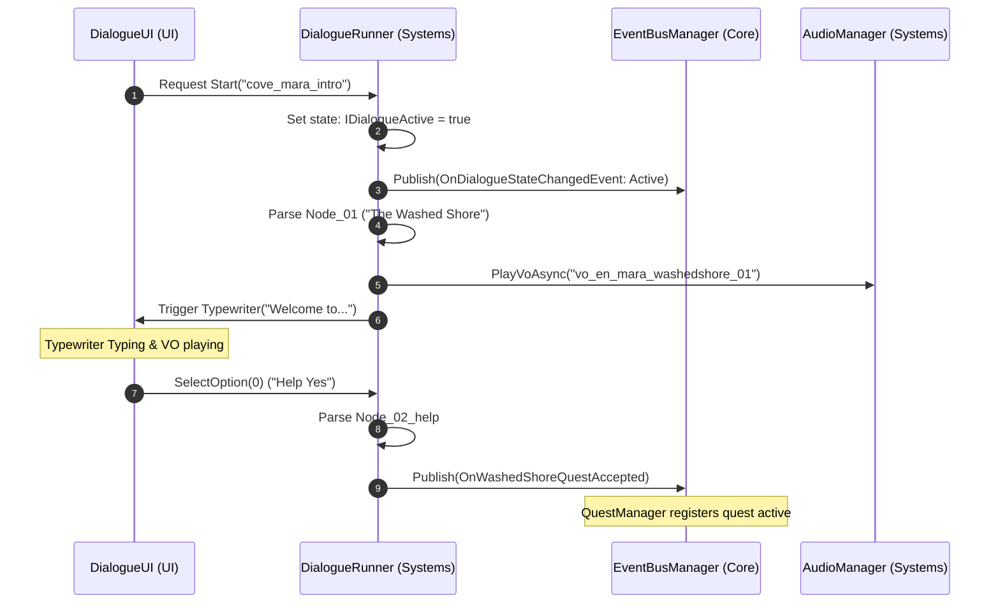

# Architectural Specification: Dialogue System

* **Status**: APPROVED
* **Date**: 2026-07-09
* **Engine Focus**: Unity 6 LTS

---

## 1. Design Intent & Requirements Traceability

The Dialogue System handles NPC dialogue branching, subtitles, typewriter text presentation, and synchronization with localized voiceover (VO) clips:

* **Pixar-Quality Storytelling (Vision §2 & §6 & GDD §4.1)**: Dialogue must flow naturally and drive emotional resolutions. The system must support branching conversations and trigger gameplay state changes directly from narrative beats.
* **Pre-Reader Narration Assistance (Vision §7 & §8 & GDD §15.2)**: Every line of dialogue must sync with a pre-recorded, localized voiceover clip. For children with dyslexia, the text typewriter effect must pad word pauses by **1.5x** to prevent reading fatigue.
* **Switch-Scan Navigation (GDD §15.3)**: Dialogue choices (branch options) must automatically join the active UI scan group, enabling users with single-switch inputs to navigate conversation forks.

---

## 2. Dialogue Graph Schema Specification (JSON)

Dialogue conversations are authored as node-based directed graphs, serialized to JSON. Each node defines speech variables, audio keys, and branching choices.

### 2.1 JSON Schema Structure (`cove_mara_intro.json`)

```json
{
  "dialogueId": "dialogue_cove_mara_washedshore_intro",
  "startNodeId": "node_01",
  "nodes": [
    {
      "nodeId": "node_01",
      "speakerKey": "npc_name_mara",
      "textKey": "cove_quest_washedshore_mara_01",
      "audioAddressableKey": "vo_en_mara_washedshore_01",
      "triggerEventOnEnter": "OnMaraDialogueStarted",
      "choices": [
        {
          "textKey": "dialogue_choice_help_yes",
          "nextNodeId": "node_02_help"
        },
        {
          "textKey": "dialogue_choice_help_no",
          "nextNodeId": "node_02_refuse"
        }
      ]
    },
    {
      "nodeId": "node_02_help",
      "speakerKey": "npc_name_mara",
      "textKey": "cove_quest_washedshore_mara_02_accept",
      "audioAddressableKey": "vo_en_mara_washedshore_02a",
      "triggerEventOnEnter": "OnWashedShoreQuestAccepted",
      "choices": []
    },
    {
      "nodeId": "node_02_refuse",
      "speakerKey": "npc_name_mara",
      "textKey": "cove_quest_washedshore_mara_02_decline",
      "audioAddressableKey": "vo_en_mara_washedshore_02b",
      "triggerEventOnEnter": "OnMaraDialogueDeclined",
      "choices": []
    }
  ]
}
```

---

## 3. Dialogue System Interfaces & Traversal Engine

The dialogue engine parses the active graph node and manages branching paths.

### 3.1 Interface Contracts

```csharp
using System.Collections.Generic;
using Cysharp.Threading.Tasks;

namespace QuestBit.Systems.Dialogue
{
    public struct DialogueChoice
    {
        public string TextKey;
        public string NextNodeId;
    }

    public interface IDialogueSystem
    {
        bool IsDialogueActive { get; }
        string CurrentSpeaker { get; }
        string CurrentText { get; }
        IReadOnlyList<DialogueChoice> CurrentChoices { get; }

        UniTask StartDialogueAsync(string dialogueGraphKey);
        void ChooseOption(int choiceIndex);
        void AdvanceDialogue();
        void ExitDialogue();
    }
}
```

### 3.2 Typewriter Speed Controller (C#)
This class renders the typewriter effect on screen. It incorporates **reading speed metrics** and **dyslexia text pacing rules**:

```csharp
using System.Text;
using UnityEngine;
using TMPro;
using Cysharp.Threading.Tasks;

namespace QuestBit.Systems.Dialogue
{
    public class TypewriterTextController : MonoBehaviour
    {
        [SerializeField] private TextMeshProUGUI _textMesh = null!;
        [SerializeField] private float _baseCharactersPerSecond = 30f;

        private System.Threading.CancellationTokenSource? _typeCts;

        /// <summary>
        /// Renders dialogue text dynamically, applying dyslexia spacing guidelines.
        /// </summary>
        public async UniTask RunTypewriterAsync(string fullText, bool isDyslexiaActive, System.Action onComplete)
        {
            _typeCts?.Cancel();
            _typeCts = new System.Threading.CancellationTokenSource();

            var sb = new StringBuilder(fullText.Length);
            float baseInterval = 1.0f / _baseCharactersPerSecond;
            float wordPauseMultiplier = isDyslexiaActive ? 1.5f : 1.0f; // Extra pause for dyslexic layout flow

            _textMesh.text = string.Empty;

            try
            {
                for (int i = 0; i < fullText.Length; i++)
                {
                    char c = fullText[i];
                    sb.Append(c);
                    _textMesh.text = sb.ToString();

                    // Apply character delays
                    if (c == ' ' || c == '.' || c == ',' || c == '!')
                    {
                        // Add extra pause duration on spaces/punctuation to let child eyes focus
                        float delay = (c == ' ' ? baseInterval * 1.5f : baseInterval * 3f) * wordPauseMultiplier;
                        await UniTask.Delay(System.TimeSpan.FromSeconds(delay), cancellationToken: _typeCts.Token);
                    }
                    else
                    {
                        await UniTask.Delay(System.TimeSpan.FromSeconds(baseInterval), cancellationToken: _typeCts.Token);
                    }
                }
                
                onComplete?.Invoke();
            }
            catch (System.OperationCanceledException)
            {
                // If user taps switch to skip, instantly render full text
                _textMesh.text = fullText;
                onComplete?.Invoke();
            }
        }

        public void SkipTypewriter(string fullText)
        {
            _typeCts?.Cancel();
            _textMesh.text = fullText;
        }

        private void OnDestroy()
        {
            _typeCts?.Cancel();
        }
    }
}
```

---

## 4. Event Bus Integration & Traversal Loop

Dialogue node transitions trigger changes in game state via the Event Bus.



---

## 5. Failure Modes & Edge Cases

### 1. VO Audio Load Failure (Stalled Traversal)
* **Symptom**: Dialogue halts, typewriter text freezes, and the interface becomes unresponsive because the VO audio load failed.
* **Mitigation**: The dialogue runner does not wait indefinitely for audio loading. If the `IAudioManager.PlayVoAsync` call fails to initialize within **1.5 seconds**, the runner defaults to visual typewriter rendering, auto-advancing on a generic character length calculation to keep play moving.

### 2. Orphaned Dialogue Nodes (Dead Ends)
* **Symptom**: A developer creates a dialogue node with no choices and no default exit node, trapping the player in dialogue state.
* **Mitigation**: The dialogue parser validates the loaded graph. If a leaf node (no choices) does not contain a flag explicitly ending the conversation (`ExitState`), the system appends a default choice ("Leave") to ensure the player can exit.

---

## 6. Verification & Automated QA

1. **Dialogue Graph Validation Script**:
   Write a static parser unit test that loads all `.json` files in `Assets/_Project/AddressableAssets/Dialogue/` and:
   * Asserts every `nextNodeId` references an existing node within the same file.
   * Asserts every `textKey` and `speakerKey` exists in the `en-US` localization table.
   * Asserts every leaf node has either an empty list of choices AND an exit flag, or contains at least one choice.

2. **Dyslexia Typewriter Interceptor Test**:
   Assert that running the typewriter in Calm Mode with `IsDyslexiaActive = true` yields a letter interval duration that is at least **1.5x** longer than the baseline profile.
