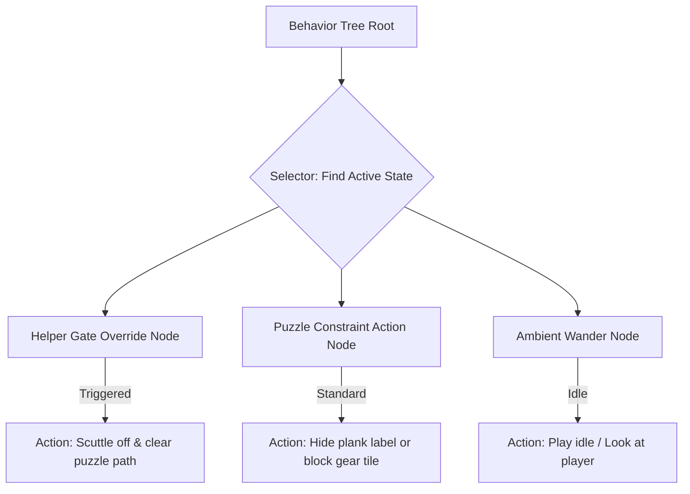

# Architectural Specification: AI System (Non-Combat & Challenge Creatures)

* **Status**: APPROVED
* **Date**: 2026-07-09
* **Engine Focus**: Unity 6 LTS

---

## 1. Design Intent & Requirements Traceability

The AI System governs the behavior of our player companion (The Spark), interactive NPCs, and puzzle-antagonist entities (Challenge Creatures):

* **Frustration-Tolerance Scaffolding (Vision §9 & GDD §2.3 & §8.1)**: QuestBit features no combat or death. AI entities exist to personify puzzle constraints ( Tetris blocks or grid obstacles). The AI system must implement "Helper Gates"—adaptive overrides that automatically soften constraints if the child experiences high struggle rates.
* **Low-End Hardware CPU Budgets (Vision §2 & GDD §1.2 & §22)**: Running high-frequency decision trees on 15 concurrent characters will lag Chromebook WebGL threads. The AI pipeline enforces a **throttled tick rate** and pre-allocates navigation pathways.
* **Ambient Coziness (Vision §2 & GDD Ch. 4)**: NPCs and the Spark must display lifelike, idle micro-expressions (turning heads, pointing toward puzzle targets) to reinforce the Pixar/Zelda environmental feel.

---

## 2. Non-Combat AI Architecture: Behavior Trees

To manage entity actions cleanly, QuestBit uses a lightweight **Behavior Tree** model. Behavior Nodes are cached in memory (zero heap allocations during active execution).

### 2.1 Behavior Tree Component Hierarchy



### 2.2 C# Base Behavior Tree Nodes

```csharp
using UnityEngine;

namespace QuestBit.Systems.AI
{
    public enum NodeStatus
    {
        Running,
        Success,
        Failure
    }

    public abstract class BehaviorNode
    {
        public abstract NodeStatus Tick(GameObject entity, Blackboard blackboard);
    }

    public class Blackboard
    {
        private readonly Dictionary<string, object> _data = new Dictionary<string, object>(8);

        public void Set(string key, object value) => _data[key] = value;
        public T Get<T>(string key) => _data.TryGetValue(key, out var val) ? (T)val : default!;
        public bool ContainsKey(string key) => _data.ContainsKey(key);
        public void Clear(string key) => _data.Remove(key);
    }
}
```

---

## 3. Cognitive Difficulty & Adaptive Pacing (Helper Gates)

To prevent learned helplessness, the AI system implements a helper gate pattern. Below is the C# controller for the **Snagglecrab** (GDD §8.3.1).

```csharp
using UnityEngine;
using VContainer;
using QuestBit.Core.EventBus;
using QuestBit.Gameplay.Events;

namespace QuestBit.Gameplay.AI
{
    public class SnagglecrabAIController : MonoBehaviour
    {
        [SerializeField] private string _puzzleId = "puzzle_cove_market_03";
        [SerializeField] private Animator _animator = null!;
        
        private IEventBus _eventBus = null!;
        private int _failedAttempts;
        private bool _isScuttled;

        private const int HELPER_GATE_MAX_FAILURES = 3;

        [Inject]
        public void Construct(IEventBus eventBus)
        {
            _eventBus = eventBus;
            _eventBus.Subscribe<OnPlankPlacedEvent>(HandlePlankPlaced);
        }

        private void OnDestroy()
        {
            _eventBus?.Unsubscribe<OnPlankPlacedEvent>(HandlePlankPlaced);
        }

        private void HandlePlankPlaced(OnPlankPlacedEvent eventData)
        {
            if (eventData.GapId != _puzzleId || _isScuttled) return;

            if (!eventData.IsSuccessfulSpan)
            {
                _failedAttempts++;
                EvaluateHelperGate();
            }
            else
            {
                // Reset failures on puzzle success
                _failedAttempts = 0; 
            }
        }

        private void EvaluateHelperGate()
        {
            // If the child fails 3 times, activate the helper gate to prevent frustration
            if (_failedAttempts >= HELPER_GATE_MAX_FAILURES)
            {
                TriggerHelperScuttle();
            }
            else
            {
                // Play curious, encouraging head-cock animation
                _animator.SetTrigger("OnPlayerMistake"); 
            }
        }

        private void TriggerHelperScuttle()
        {
            _isScuttled = true;
            Debug.Log($"[AI] Helper Gate triggered on Snagglecrab {_puzzleId}. Scuttling off.");

            // 1. Play scuttle animation
            _animator.SetTrigger("OnScuttleAway");

            // 2. Clear visual constraint (reveal hidden plank label, GDD §8.3.1)
            RevealHiddenLabels();

            // 3. Disable collision mesh so player can traverse easily
            GetComponent<Collider2D>().enabled = false;
        }

        private void RevealHiddenLabels()
        {
            // Fires visual event to reveal plank tags
        }
    }
}
```

---

## 4. Tick Rate & Performance Budgets

To satisfy the low-spec Chromebook budget, the AI loop uses a **throttled tick pipeline**:

* **AI Tick Rate**: **5Hz** (decision logic runs once every **200ms**).
* **Movement Interpolation**: Frame-rate independent (`Update` using `Time.deltaTime`), ensuring smooth visuals while keeping CPU usage low.
* **CPU Execution Budget**: **<1.5ms** total execution time per frame.
* **Pathfinding**: Static NPCs utilize simple **Waypoint Traversal Paths** (pre-calculated lines). Dynamic characters (The Spark) use Unity **NavMesh2D**, which has an execution overhead of <0.2ms per path solve.

---

## 5. Failure Modes & Edge Cases

### 1. NavMesh Target Unreachable (Stuck Entities)
* **Symptom**: The Spark companion gets stuck behind a rock collison mesh, running in place and failing to follow the player.
* **Mitigation**: Implement a **Teleport Threshold**. If the physical distance between the player and the Spark exceeds **6.0 meters** for longer than **2.0 seconds**, the Spark AI disables NavMesh tracking, plays a short puff-smoke particle loop, and teleports directly to the player's coordinate anchor.

### 2. Event Listener GC Leak
* **Symptom**: Memory leak during biome transitions.
* **Cause**: Challenge Creatures holding subscriptions in the Event Bus after being destroyed.
* **Mitigation**: Strictly implement `OnDestroy` cleanup inside all AI controllers, unregistering from the Event Bus before disposing of MonoBehaviour components.

---

## 6. Verification & Validation Tests

1. **Helper Gate Regression Test**:
   Write a PlayMode integration test that instantiates a Snagglecrab AI and sends **3 sequential failed** `OnPlankPlacedEvent` dispatches:
   * *Assert*: Verify that the animator trigger parameter `OnScuttleAway` is set to true.
   * *Assert*: Verify that the collider component is disabled.

2. **Tick Rate Performance Assertion**:
   Compile a test scene containing 15 active AI entities. Profiler checks must confirm that the total AI thread execution time does not exceed **1.0ms** on the Chromebook target.
