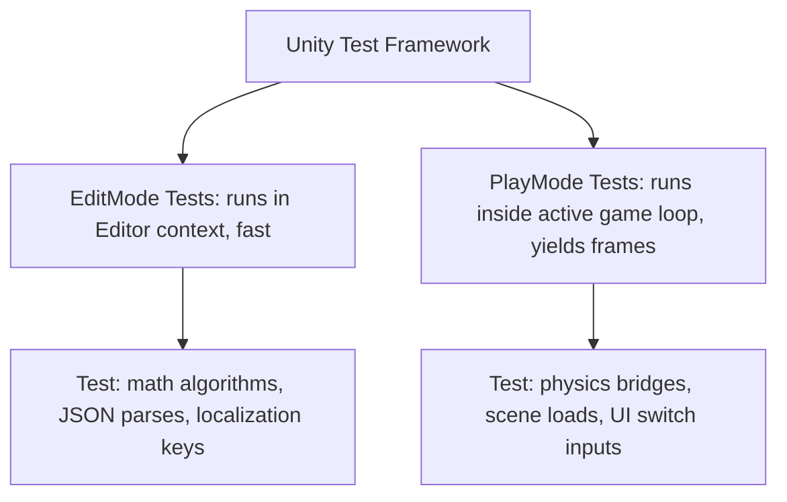

# Architectural Specification: Testing Strategy

* **Status**: APPROVED
* **Date**: 2026-07-09
* **Engine Focus**: Unity 6 LTS
* **Testing Library**: **Unity Test Framework (UTF)** (integrating NUnit)

---

## 1. Design Intent & Requirements Traceability

The Testing Strategy establishes automated and manual quality gates across the development lifecycle. It directly guarantees core player-facing promises:

* **High-Frequency Accessibility Testing (Vision §8 & GDD Ch. 15)**: The input scanning loop must remain functional across all screens. We must simulate rapid switch inputs to verify focus outlines, layout wrapping, and debounce thresholds.
* **Offline-First Integration Safety (Vision §5 & GDD §1.2 & §21)**: Telemetry and save systems must recover from offline-to-online transitions without losing progress or corrupting files. Integration tests must automate connection loss.
* **Zero Failure Pacing (Vision §2 & GDD §2.3)**: State machines, quest objectives, and dialogue paths must be fully validated in continuous integration to prevent soft-locks or scene freezes on Chromebooks.

---

## 2. Testing Framework Setup & Mocking

QuestBit splits automated tests into two distinct domains inside the Unity Test Framework (UTF):



### 2.1 EditMode Tests (Fast Unit Level)
* *Execution time*: <5ms per test.
* *Responsibilities*: Verification of localized string lookups, JSON dialogue graph validation, math plank size calculations, and schema version migrations.

### 2.2 PlayMode Tests (Engine Integration Level)
* *Execution time*: 100ms - 2000ms per test.
* *Responsibilities*: Verification of NavMesh pathfinding, UI Canvas instantiations, additive scene streaming budgets, and controller speed matching.

### 2.3 Mocking Strategy
The Dependency Injection framework (`VContainer`) simplifies testing by allowing mock implementations of global systems to be injected during test setup:

```csharp
using NSubstitute;
using NUnit.Framework;
using VContainer;
using VContainer.Unity;
using QuestBit.Systems.Save;
using QuestBit.Core.EventBus;

namespace QuestBit.RuntimeTests
{
    [TestFixture]
    public class QuestIntegrationTestSetup
    {
        protected IContainerBuilder Builder = null!;
        protected ISaveSystem MockSaveSystem = null!;
        protected IEventBus MockEventBus = null!;

        [SetUp]
        public void Arrange()
        {
            Builder = new ContainerBuilder();
            
            // 1. Instantiate mock interfaces using NSubstitute
            MockSaveSystem = Substitute.For<ISaveSystem>();
            MockEventBus = Substitute.For<IEventBus>();

            // 2. Inject stubs instead of heavy filesystem/database targets
            Builder.RegisterInstance<ISaveSystem>(MockSaveSystem);
            Builder.RegisterInstance<IEventBus>(MockEventBus);
        }
    }
}
```

---

## 3. High-Frequency Input Simulation (Switch-Scan)

To verify that the Switch-Scan Controller (GDD §15) correctly processes switch activations and ignores spastic muscle double-taps, PlayMode tests simulate raw inputs:

```csharp
using System.Collections;
using UnityEngine;
using UnityEngine.TestTools;
using NUnit.Framework;
using QuestBit.Systems.Input;

namespace QuestBit.RuntimeTests.Accessibility
{
    public class SwitchScanInputTests : QuestIntegrationTestSetup
    {
        [UnityTest]
        public IEnumerator VerifySwitchDebounceFiltersDoublePress()
        {
            // 1. Setup Input Manager with a 150ms debounce threshold
            var config = new SwitchScanConfig { AutoScanInterval = 1.5s, DebounceThresholdMs = 150f };
            var scanController = new GameObject("TestScan").AddComponent<SwitchScanController>();
            
            var targetMock = new MockScanTarget();
            scanController.Register(targetMock);

            // 2. Trigger first switch activation
            scanController.TriggerSelect();
            Assert.AreEqual(1, targetMock.SelectCount);

            // 3. Trigger immediate second activation (50ms elapsed - within debounce window)
            yield return new WaitForSeconds(0.05f);
            scanController.TriggerSelect();

            // 4. Assert second activation was ignored
            Assert.AreEqual(1, targetMock.SelectCount, "Input manager failed to filter double-press within debounce window.");

            // 5. Trigger third activation (200ms elapsed - outside debounce window)
            yield return new WaitForSeconds(0.2f);
            scanController.TriggerSelect();

            // 6. Assert input registered successfully
            Assert.AreEqual(2, targetMock.SelectCount);
        }
    }

    public class MockScanTarget : IScanTarget
    {
        public GameObject GameObject => null!;
        public int ScanOrderPriority => 1;
        public bool IsSelectable => true;
        public int SelectCount { get; private set; }

        public void OnFocusEnter() { }
        public void OnFocusExit() { }
        public void OnSelect() => SelectCount++;
    }
}
```

---

## 4. Offline-to-Online State Integration Validation

PlayMode integration tests must validate that local queues cache data offline and transmit it successfully upon reconnection:

1. **Simulate Connection Drop**: Set network client offline status flag to false.
2. **Generate Events**: Call `IDataPipeline.LogEvent` 12 times and `ISaveSystem.SaveGameAsync` once.
3. **Verify Local Write**: Assert that `telemetry_cache.json` exists on disk and contains exactly 12 lines.
4. **Restore Network**: Set network client offline status flag to true.
5. **Trigger Connection Callback**: Dispatch network status change to the data pipeline.
6. **Verify Server Ingestion**: Verify that the network queue flushes and the server endpoint receives the batched JSON payload.

---

## 5. Failure Modes & Edge Cases

### 1. WebGL Test Running Limitations
* **Symptom**: Integration tests executing `UniTask.Delay` or frame yields fail when compiled directly to WebGL test runner templates.
* **Mitigation**: Standardize on executing all PlayMode tests inside the **Standalone Player build (Windows/Mac)** on CI/CD runner environments, rather than inside WebGL browser wrappers, which have unreliable asynchronous threading parameters.

### 2. Flaky Tests (Race Conditions on Scene Loads)
* **Symptom**: Scene load integration tests occasionally fail due to slow disk speeds on virtual machine runners.
* **Mitigation**: Never use raw `yield return new WaitForSeconds()` when waiting for scene loads. Standardize on awaiting the async operation handle using `UniTask.WaitUntil` or `yield return operationHandle`.

---

## 6. Verification & Validation Metrics

To ensure testing completeness, the project defines the following **Code Quality Gates**:

* **Minimum Test Coverage (Scripts)**: **>80% Code Coverage** on `QuestBit.Core` and `QuestBit.Systems` assemblies (verified via the Unity Code Coverage package).
* **Automated Regression Executions**: The CI/CD pipeline runs all EditMode and PlayMode tests on every Pull Request, blocking merge if any test fails.
