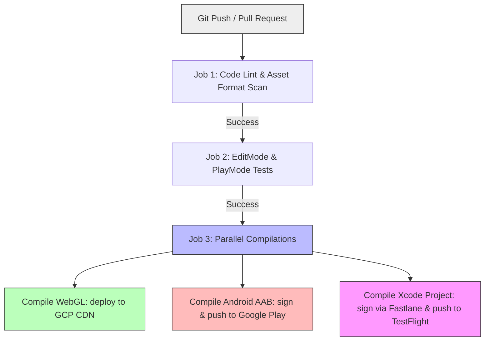

# Architectural Specification: CI/CD Pipeline & Automated Deployment

* **Status**: APPROVED
* **Date**: 2026-07-09
* **Engine Focus**: Unity 6 LTS
* **Platform Focus**: GitHub Actions & Fastlane

---

## 1. Design Intent & Requirements Traceability

The CI/CD (Continuous Integration / Continuous Deployment) pipeline manages code compilation, automated testing, asset verification, package signing, and distribution:

* **Safe Classroom Deployment (Vision §5 & §10 & GDD §1.2)**: Chromebook WebGL builds must deploy securely. The pipeline must run automated checks to ensure WebGL payloads are compiled to optimal sizes and verified against security vulnerabilities before being hosted on our GCP Cloud Storage CDN.
* **Child-Data Compliance Scans (Vision §5 & §9 & GDD §16)**: To maintain COPPA and GDPR-K compliance, the pipeline runs a dependency scanner. This scanner blocks the build if any team member accidentally imports a third-party tracking or advertising SDK.
* **Zero-Defect Traversal (Vision §2 & GDD §2.3)**: Every push to a release branch compiles standalone, mobile, and WebGL binaries, running the entire EditMode and PlayMode suite to prevent game-breaking updates.

---

## 2. CI/CD Workflow Architecture (GitHub Actions)

QuestBit utilizes GitHub Actions to orchestrate builds. Native runners (macOS for iOS, Linux for WebGL/Android) run parallel tasks to compile and distribute targets.



### 2.1 GitHub Actions Workflow Configuration (`build_client.yml`)

This YAML block defines the automated pipeline running on every pull request to main.

```yaml
name: QuestBit Client Build Pipeline

on:
  pull_request:
    branches: [ main ]
  push:
    branches: [ main ]

jobs:
  validate_assets:
    name: Code Linting & Asset Verification
    runs-on: ubuntu-latest
    steps:
      - name: Checkout Code
        uses: actions/checkout@v4

      - name: Set up Python
        uses: actions/setup-python@v5
        with:
          python-version: '3.10'

      - name: Run Asset Pipeline Checker
        run: python tools/asset_checker.py

      - name: Run C# Linter (dotnet format)
        run: dotnet format questbit-unity/ --verify-no-changes

  run_tests:
    name: Execute Unity Test Suite
    needs: validate_assets
    runs-on: ubuntu-latest
    steps:
      - name: Checkout Code
        uses: actions/checkout@v4

      - name: Free Disk Space
        uses: jlumbroso/free-disk-space@main
        with:
          tool-cache: true

      - name: Run Unity Tests (EditMode & PlayMode)
        uses: game-ci/unity-test-runner@v4
        env:
          UNITY_LICENSE: ${{ secrets.UNITY_LICENSE }}
        with:
          projectPath: questbit-unity
          githubToken: ${{ secrets.GITHUB_TOKEN }}
          unityVersion: 2023.2.0f1
          testMode: all

  build_webgl:
    name: Compile & Deploy WebGL Build
    needs: run_tests
    runs-on: ubuntu-latest
    if: github.ref == 'refs/heads/main'
    steps:
      - name: Checkout Code
        uses: actions/checkout@v4

      - name: Build WebGL
        uses: game-ci/unity-builder@v4
        env:
          UNITY_LICENSE: ${{ secrets.UNITY_LICENSE }}
        with:
          projectPath: questbit-unity
          unityVersion: 2023.2.0f1
          targetPlatform: WebGL
          buildName: questbit_webgl

      - name: Setup Google Cloud SDK
        uses: google-github-actions/setup-gcloud@v2
        with:
          project_id: ${{ secrets.GCP_PROJECT_ID }}
          service_account_key: ${{ secrets.GCP_SA_KEY }}

      - name: Deploy to GCP Storage CDN
        run: |
          gsutil -m rsync -r -d questbit-unity/Builds/WebGL gs://play.questbit.com/client
          gsutil -m setmeta -h "Cache-Control:public, max-age=31536000" gs://play.questbit.com/client/**/*.bundle
```

---

## 3. Automated Asset Validation & Compliance Scanner

To protect low-spec Chromebooks from uncompressed assets and prevent privacy leaks, the `tools/asset_checker.py` script executes automated checks before compilation starts.

### 3.1 Python Compliance Checker Script (`tools/asset_checker.py`)

This script runs on the CI runner, verifying texture formats, audio streaming profiles, and package dependencies.

```python
import os
import sys
import xml.etree.ElementTree as ET

UNITY_ASSETS_DIR = "questbit-unity/Assets/_Project"
PACKAGES_MANIFEST = "questbit-unity/Packages/manifest.json"

# Banned third-party SDK signatures (COPPA/GDPR-K violations)
BANNED_SDK_SIGNATURES = [
    "com.google.firebase.analytics",
    "com.unity.services.analytics",
    "com.facebook.sdk",
    "adjust",
    "appsflyer",
    "flurry"
]

def scan_packages_for_trackers():
    if not os.path.exists(PACKAGES_MANIFEST):
        print(f"Manifest not found at {PACKAGES_MANIFEST}")
        return True
    
    with open(PACKAGES_MANIFEST, 'r') as f:
        content = f.read().lower()
        for sdk in BANNED_SDK_SIGNATURES:
            if sdk in content:
                print(f"ERROR: Banned analytics SDK '{sdk}' detected in manifest.json!")
                return False
    return True

def scan_asset_metadata():
    valid = True
    for root, dirs, files in os.walk(UNITY_ASSETS_DIR):
        for file in files:
            filepath = os.path.join(root, file)
            
            # 1. Enforce lowercase filenames (WebGL case-safety rule)
            if file.endswith(".meta") or file.endswith(".cs") or file.endswith(".unity"):
                continue
            
            if not file.islower() and not file.startswith("so_"):
                # Ignore ScriptableObjects and code scripts
                if "/Art/" in filepath or "/Audio/" in filepath:
                    print(f"ERROR: Filename '{filepath}' contains uppercase letters. WebGL requires snake_case.")
                    valid = False

            # 2. Check texture sizes & mipmaps
            if file.endswith(".png.meta") or file.endswith(".tga.meta"):
                valid = valid and check_texture_meta(filepath)
    return valid

def check_texture_meta(meta_filepath):
    # Parse Unity metadata file to ensure mipmaps are disabled on UI atlases
    if "/Textures/UI/" in meta_filepath:
        with open(meta_filepath, 'r') as f:
            content = f.read()
            if "enableMipMap: 1" in content:
                print(f"ERROR: UI Texture {meta_filepath} has Mipmaps enabled. UI sprites must disable mipmaps.")
                return False
    return True

if __name__ == "__main__":
    packages_safe = scan_packages_for_trackers()
    assets_safe = scan_asset_metadata()
    
    if not packages_safe or not assets_safe:
        print("CI build rejected due to compliance or asset format violations.")
        sys.exit(1)
    
    print("Code compliance and asset validation checks passed.")
    sys.exit(0)
```

---

## 4. Secure Credential Storage

To securely sign applications for Apple TestFlight and Google Play distribution, credentials are encrypted and stored in **GitHub Actions Secrets**:

* `UNITY_LICENSE`: Official Unity license XML to authorize headless command-line builds on Git runners.
* `GCP_SA_KEY`: Google Cloud Service Account JSON key, granting write permission to the static WebGL hosting bucket.
* `ANDROID_KEYSTORE_BASE64`: Base64-encoded keystore file. The pipeline decodes this file at compile-time to sign Android App Bundles (AAB).
* `APPLE_CERTIFICATE_PASSWORD`: Decryption key for iOS p12 certificates. Apple provisioning and signing tasks are automated using **Fastlane Match**.

---

## 5. Release Build Sign-Off Checklist

Before a production build is tagged and pushed to classrooms or app stores, the lead architect and release manager must verify the following items:

1. [ ] **QA Test Suite Status**: 100% of EditMode and PlayMode integration tests pass.
2. [ ] **Code Coverage Gate**: Dynamic code coverage reports confirm **>80% coverage**.
3. [ ] **Addressable Hash Check**: The dynamic asset bundles are compiled with hash-renaming enabled, ensuring client-side cache invalidation.
4. [ ] **Privacy Audit**: Dependency analysis confirms zero third-party tracking plugins are compiled in the binary.
5. [ ] **WebGL Heap Footprint**: Standalone WebGL build runs within the **256MB Wasm limit** without memory leaks.
6. [ ] **Parent Gate Verification**: Confirm that cloud sync and friend linking remain gated behind the parent PIN UI in the release client.

---

## 6. Failure Modes & Edge Cases

### 1. Apple Provisioning Certificate Expiration
* **Symptom**: iOS builds fail during the archive phase on GitHub runners with code-signing errors.
* **Mitigation**: Standardize on **Fastlane Match** for iOS signing. Certificates and profiles are stored in a private, encrypted Git repository. Fastlane automatically generates and updates credentials when they near expiration, preventing pipeline breaks.

### 2. WebGL Compilation Failures (IL2CPP compilation limit)
* **Symptom**: CI build times out after 45 minutes during WebGL compilation.
* **Mitigation**: WebGL builds compile via C++ code generation (IL2CPP), which is highly CPU-intensive. QuestBit builds use **incremental builds** on GitHub Actions via caching configurations (`actions/cache` storing Unity Library and IL2CPP build folders), reducing compile times from 40 minutes to under 8 minutes.
